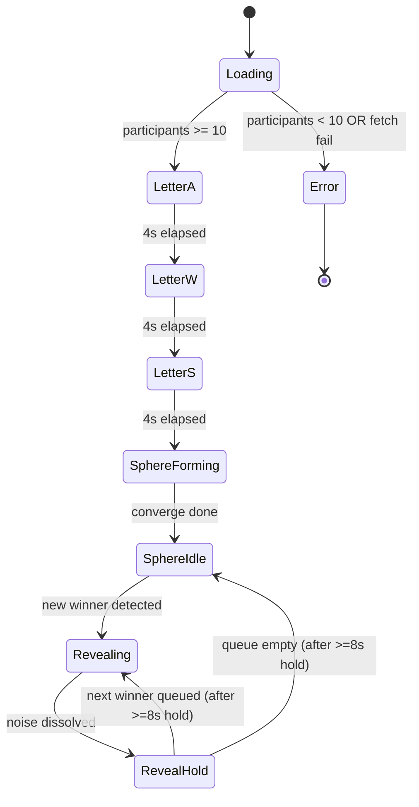
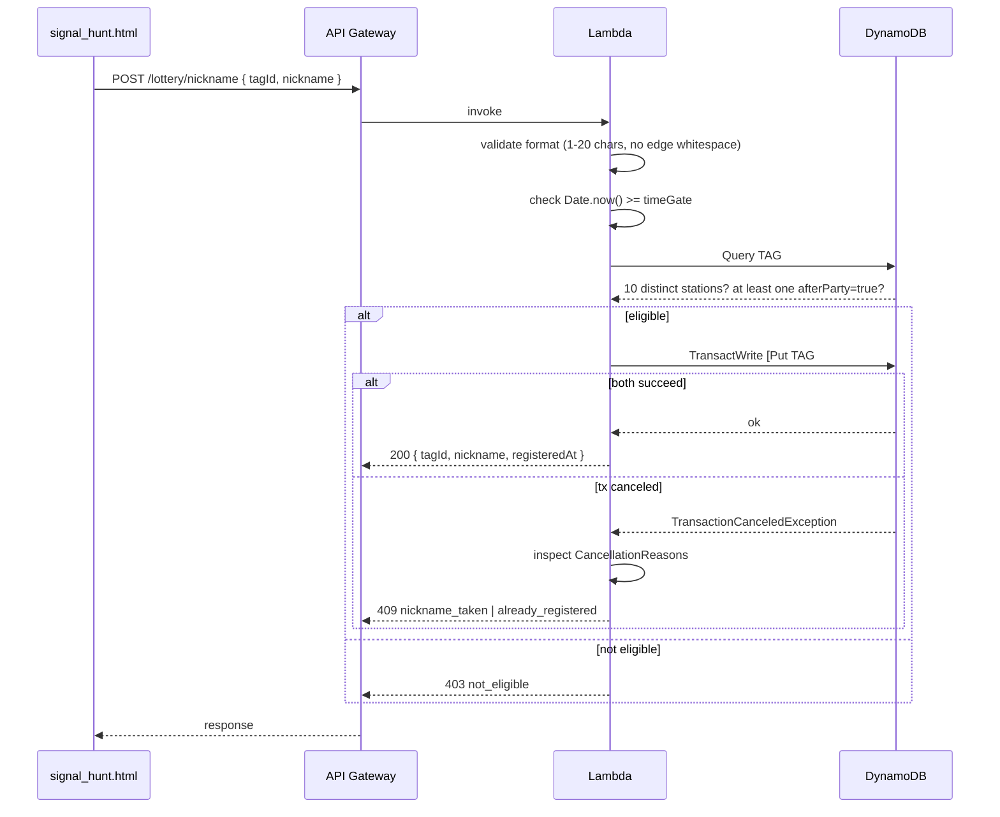
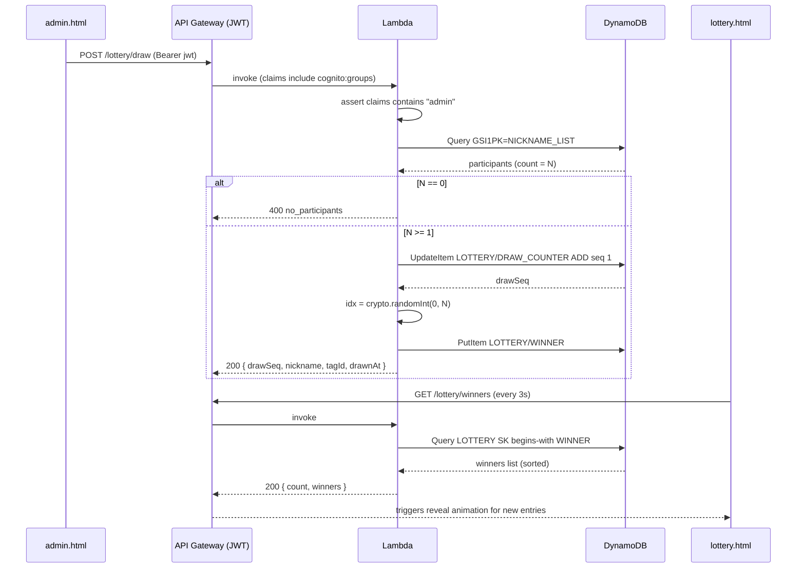

# Design Document: After Party Lottery

## Overview

The After Party Lottery feature extends the existing Signal Over Noise NFC check-in system with a time-gated lottery mechanism for the After Party event. Attendees who (a) have completed all 10 station check-ins and (b) have at least one check-in recorded after 17:00 CST on June 28, 2026 are eligible to register a unique nickname. Their nicknames are then displayed on a big-screen 3D animation (`lottery.html`) that runs through a letter-formation sequence (A → W → S), converges into a noise-wrapped rotating sphere, and finally reveals winners as clear "signals" emerging from the noise when an administrator triggers a draw.

The feature reuses the existing serverless infrastructure (single Lambda `CheckinHandler`, single DynamoDB table, HTTP API Gateway with the existing JWT authorizer for admin endpoints) so that no new stack is required. The `signal_hunt.html` Progress Page is augmented with a lottery-status section that appears after the time gate.

### Key Design Decisions

1. **Time gate as a check-in attribute, not a separate event** — Each check-in record stores a boolean `afterParty` computed at write time from the configured `AFTER_PARTY_TIME_GATE` env var. This keeps eligibility queries to a single Query on `TAG#{tagId}` and avoids any retroactive scanning when the gate is reached.
2. **Nickname uniqueness via separate uniqueness record** — A second item with `PK = NICKNAME#{nickname}` is created with a `ConditionExpression: attribute_not_exists(PK)`. The uniqueness check is enforced atomically by DynamoDB without a conditional read-then-write race.
3. **Cryptographic random draw with atomic sequence counter** — Draws use `crypto.randomInt` over the participant array length, and each draw uses an `UpdateItem` atomic increment on `LOTTERY / DRAW_COUNTER` to guarantee unique, monotonic sequence numbers under concurrent draw requests.
4. **Polling over WebSocket** — Requirement 9 calls for polling (not push). This avoids API Gateway WebSocket complexity and gives the lottery page a deterministic 3-second cadence with explicit disconnect detection. The tradeoff (up to 3-second reveal delay) is acceptable for an in-room display where the admin triggers the draw on cue.
5. **Three.js for the 3D animation** — Three.js is the standard, well-documented WebGL library for browser 3D, includes `TextGeometry` for nickname meshes, `Points`/shader materials for the noise particle effect, and `Tween.js`-style interpolation for letter morph transitions.
6. **Public participants endpoint, JWT-protected draw endpoint** — `/lottery/participants` is unauthenticated because the lottery display PC has no credentials; `/lottery/draw` and `/lottery/winners` reuse the existing JWT authorizer from the role-based-scan-system spec, restricted to the `admin` group.

## Architecture

### System Context

```mermaid
graph TB
    subgraph "Big-screen Display"
        LOT[lottery.html<br/>Three.js scene]
    end

    subgraph "Attendee Devices"
        PROG[signal_hunt.html<br/>Progress Page]
    end

    subgraph "Admin Devices"
        ADM[admin.html<br/>Draw trigger]
    end

    subgraph "API Gateway HTTP API"
        PUB[Public routes<br/>/lottery/participants<br/>/checkin/{tagId}<br/>POST /lottery/nickname]
        AUTH[JWT-protected routes<br/>POST /lottery/draw<br/>GET /lottery/winners]
    end

    subgraph "Lambda CheckinHandler"
        ROUTER[router.mjs]
        LH[lottery-handler.mjs<br/>NEW]
        CH[checkin-handler.mjs<br/>+afterParty flag]
        PH[progress-handler.mjs<br/>+lotteryEligible+nickname]
    end

    subgraph "DynamoDB Single Table"
        DDB[(SignalHuntTable)]
    end

    LOT -- poll 3s --> PUB
    PROG --> PUB
    ADM -- JWT --> AUTH
    PUB --> ROUTER
    AUTH --> ROUTER
    ROUTER --> LH
    ROUTER --> CH
    ROUTER --> PH
    LH --> DDB
    CH --> DDB
    PH --> DDB
```

### Request Flow Summary

| Flow | Path | Auth | Latency Target |
|------|------|------|----------------|
| NFC check-in (with afterParty flag) | POST /checkin | None | 500ms |
| Progress + lottery status | GET /checkin/{tagId} | None | 3s |
| Register nickname | POST /lottery/nickname | None (eligibility check) | 2s |
| List participants | GET /lottery/participants | None | 3s |
| Trigger draw | POST /lottery/draw | JWT (admin) | 3s |
| List winners | GET /lottery/winners | JWT (admin) | 3s |

### Configuration

A single environment variable on the `CheckinHandler` Lambda:

| Variable | Default | Format | Purpose |
|---|---|---|---|
| `AFTER_PARTY_TIME_GATE` | `2026-06-28T09:00:00Z` | ISO 8601 UTC | Threshold above which check-ins are classified as After Party |

The Lambda parses this value at module load time. If parsing fails (`isNaN(Date.parse(value))`), the module throws — this surfaces as a Lambda init error and prevents the function from accepting traffic, satisfying Requirement 1.4.

## Components and Interfaces

### 1. Backend Module Changes

#### 1.1 Time Gate Helper (`lambda/checkin/src/utils/time.mjs`)

Add helpers to read and apply the time gate:

```javascript
let CACHED_TIME_GATE_MS = null;

/**
 * Returns the After Party time gate as Unix epoch milliseconds.
 * Parsed once at module load. Throws if AFTER_PARTY_TIME_GATE is malformed.
 * @returns {number}
 */
export function getAfterPartyTimeGateMs() {
  if (CACHED_TIME_GATE_MS !== null) return CACHED_TIME_GATE_MS;
  const raw = process.env.AFTER_PARTY_TIME_GATE || '2026-06-28T09:00:00Z';
  const ms = Date.parse(raw);
  if (Number.isNaN(ms)) {
    throw new Error(`Invalid AFTER_PARTY_TIME_GATE value: ${raw}. Expected ISO 8601 UTC.`);
  }
  CACHED_TIME_GATE_MS = ms;
  return ms;
}

/**
 * Returns true if the given timestamp (ms or ISO) is at or after the time gate.
 * @param {number|string} timestamp
 * @returns {boolean}
 */
export function isAfterPartyCheckin(timestamp) {
  const ms = typeof timestamp === 'string' ? Date.parse(timestamp) : timestamp;
  return ms >= getAfterPartyTimeGateMs();
}
```

Module load happens before any handler invocation, so a malformed value causes the Lambda to fail initialization with the parsed error message (Requirement 1.4).

#### 1.2 Check-in Handler Augmentation (`lambda/checkin/src/checkin-handler.mjs`)

When persisting a check-in record, set the `afterParty` boolean by comparing `currentTime` to the time gate. This applies only to newly-persisted check-ins; cooldown-rejected duplicates do not change the existing record. The new write fragment:

```javascript
import { isAfterPartyCheckin } from './utils/time.mjs';

// ... inside handleCheckin, replacing the PutCommand body:
await client.send(new PutCommand({
  TableName: tableName,
  Item: {
    ...buildKey(`TAG#${tagId}`, `CHECKIN#${stationId}`),
    GSI1PK: `STATION#${stationId}`,
    GSI1SK: `CHECKIN#${checkinTime}`,
    tagId,
    stationId,
    checkinTime,
    afterParty: isAfterPartyCheckin(currentTime),
    ttl,
  },
}));
```

#### 1.3 Progress Handler Augmentation (`lambda/checkin/src/progress-handler.mjs`)

Extend the response with three new fields: `afterPartyEligible`, `lotteryEligible`, and `nickname`. The handler reads the nickname record (`TAG#{tagId} / NICKNAME`) and computes eligibility from the existing check-in items:

```javascript
import { getAfterPartyTimeGateMs } from './utils/time.mjs';

// After loading checkinItems and computing `completed`:

const afterPartyEligible = validCheckins.some(item => item.afterParty === true);
const beforeGate = Date.now() < getAfterPartyTimeGateMs();

// Eligibility logic
let lotteryEligible = false;
let lotteryReason = null;
if (!beforeGate) {
  if (completed && afterPartyEligible) {
    lotteryEligible = true;
  } else if (!completed && !afterPartyEligible) {
    lotteryEligible = false;
    lotteryReason = 'incomplete_stations_and_no_after_party_checkin';
  } else if (!completed) {
    lotteryEligible = false;
    lotteryReason = 'incomplete_stations';
  } else {
    lotteryEligible = false;
    lotteryReason = 'after_party_checkin_required';
  }
}

// Look up nickname record (best-effort)
let nickname = null;
try {
  const nickResult = await client.send(new GetCommand({
    TableName: tableName,
    Key: buildKey(`TAG#${tagId}`, 'NICKNAME'),
  }));
  if (nickResult.Item && nickResult.Item.nickname) {
    nickname = nickResult.Item.nickname;
  }
} catch (err) {
  console.error('DynamoDB error fetching nickname record:', err);
}

const responseBody = {
  tagId,
  totalCheckins,
  completed,
  rewardCode,
  stations,
  afterPartyEligible,
  stationsRemaining: completed ? 0 : (TOTAL_STATIONS - totalCheckins),
};

if (!beforeGate) {
  responseBody.lotteryEligible = lotteryEligible;
  if (lotteryReason) responseBody.lotteryReason = lotteryReason;
  if (nickname) responseBody.nickname = nickname;
}

return ok(responseBody);
```

Per Requirement 2.5, `lotteryEligible` and `lotteryReason` are omitted entirely when the current time is before the gate.

#### 1.4 Lottery Handler (`lambda/checkin/src/lottery-handler.mjs` — NEW)

A single new module exporting four handlers:

```javascript
import { GetCommand, PutCommand, QueryCommand, UpdateCommand, TransactWriteCommand }
  from '@aws-sdk/lib-dynamodb';
import { randomInt } from 'node:crypto';
import { getDocClient, getTableName, buildKey } from './utils/dynamo.mjs';
import { getAfterPartyTimeGateMs, isoNow, now } from './utils/time.mjs';
import * as response from './utils/response.mjs';

const NICKNAME_MIN = 1;
const NICKNAME_MAX = 20;
const TOTAL_STATIONS = 10;

/** POST /lottery/nickname  body: { tagId, nickname } */
export async function handleNicknameRegister(body) { /* see flow below */ }

/** GET /lottery/participants */
export async function handleListParticipants() { /* see flow below */ }

/** POST /lottery/draw  (JWT admin) */
export async function handleDraw(claims) { /* see flow below */ }

/** GET /lottery/winners  (JWT admin) */
export async function handleListWinners(claims) { /* see flow below */ }
```

##### 1.4.1 Nickname registration flow

1. **Validate body**: `tagId` is non-empty trimmed string; `nickname` length 1–20 after trim, no leading/trailing whitespace, only printable Unicode (excluding Unicode category `Cc` — control characters). Reject with 400 on failure.
2. **Time-gate check**: If `Date.now() < getAfterPartyTimeGateMs()`, return 403 `lottery_not_open`.
3. **Eligibility check**: Query `TAG#{tagId}` SK begins-with `CHECKIN#`. Verify the tag has 10 distinct stationIds and at least one record with `afterParty === true`. If not, return 403 `not_eligible`.
4. **Atomic uniqueness write**: Use `TransactWriteCommand` with two items:
   - Put `{ PK: TAG#{tagId}, SK: NICKNAME, nickname, registeredAt }` with `ConditionExpression: attribute_not_exists(PK)` — fails if this tag already has a nickname → 409 `nickname_already_registered_for_tag`.
   - Put `{ PK: NICKNAME#{nickname}, SK: RESERVED, tagId }` with `ConditionExpression: attribute_not_exists(PK)` — fails if another tag holds this nickname → 409 `nickname_taken`.
   - Both writes either succeed or both fail (DynamoDB transaction semantics). The handler inspects `CancellationReasons` to determine which condition failed and returns the corresponding 409.
5. Return 200 with `{ tagId, nickname, registeredAt }`.

Pseudocode:

```javascript
const tx = await client.send(new TransactWriteCommand({
  TransactItems: [
    {
      Put: {
        TableName: tableName,
        Item: { ...buildKey(`TAG#${tagId}`, 'NICKNAME'), tagId, nickname, registeredAt },
        ConditionExpression: 'attribute_not_exists(PK)',
      },
    },
    {
      Put: {
        TableName: tableName,
        Item: { ...buildKey(`NICKNAME#${nickname}`, 'RESERVED'), tagId, nickname, registeredAt },
        ConditionExpression: 'attribute_not_exists(PK)',
      },
    },
  ],
}));
// On TransactionCanceledException, inspect err.CancellationReasons[i].Code
//   reasons[0].Code === 'ConditionalCheckFailed' → tag already registered (409 already_registered)
//   reasons[1].Code === 'ConditionalCheckFailed' → nickname taken    (409 nickname_taken)
```

##### 1.4.2 Participants list flow

1. Use a GSI to enumerate all reserved nicknames. Add a new GSI key on the `NICKNAME#{nickname} / RESERVED` records: `GSI1PK = NICKNAME_LIST`, `GSI1SK = nickname`. Query GSI1 with `GSI1PK = 'NICKNAME_LIST'`. Each item carries the bound `tagId`.
2. For each result, the participant's eligibility was confirmed at registration time. Eligibility cannot regress (check-in records are not deleted), so the result set is the participant list.
3. Return `{ count, participants: [{ nickname }, …] }` with `count = participants.length`. Do not return tagIds (privacy).

Pagination: With ≤500 participants, results fit in a single Query response (1MB limit, ~120 bytes/item ≈ 8000 items capacity).

##### 1.4.3 Draw flow

1. **Auth check**: `claims['cognito:groups']` must include `admin`. If not, return 403 `forbidden`. (API Gateway JWT authorizer already enforces token validity → 401 on missing/invalid token.)
2. **Load participants**: same Query as `handleListParticipants`.
3. **No participants**: If empty, return 400 `no_participants`.
4. **Atomic draw sequence**: `UpdateItem` on `LOTTERY / DRAW_COUNTER`:
   ```javascript
   const counterResult = await client.send(new UpdateCommand({
     TableName: tableName,
     Key: buildKey('LOTTERY', 'DRAW_COUNTER'),
     UpdateExpression: 'ADD seq :one',
     ExpressionAttributeValues: { ':one': 1 },
     ReturnValues: 'UPDATED_NEW',
   }));
   const drawSeq = counterResult.Attributes.seq;
   ```
5. **Cryptographic selection**: `const idx = randomInt(0, participants.length);` → winner = `participants[idx]`.
6. **Persist winner**: `PutCommand` `{ PK: LOTTERY, SK: WINNER#{paddedSeq}, drawSeq, nickname, tagId, drawnAt }` where `paddedSeq` is `String(drawSeq).padStart(6, '0')` so `SK` sorts chronologically as a string.
7. Return `{ drawSeq, nickname, tagId, drawnAt }`.

Concurrent draws: the atomic counter guarantees unique sequence numbers; each draw independently re-queries the participant list, so two concurrent draws may legitimately select the same winner (Requirement 5.4 explicitly permits this).

##### 1.4.4 Winners list flow

1. Auth check (same as draw).
2. `Query` on `PK = LOTTERY`, `SK begins_with WINNER#`. Returns items in `SK` ascending order, which equals chronological draw order due to the zero-padded sequence number.
3. Return `{ count, winners: [{ drawSeq, nickname, tagId, drawnAt }, …] }`.

#### 1.5 Router Update (`lambda/checkin/src/router.mjs`)

Add four route matches before the catch-all 404. The JWT authorizer is configured at the API Gateway route level; the handler still inspects `claims` to enforce admin-group membership.

```javascript
// POST /lottery/nickname (public — eligibility checked in handler)
if (method === 'POST' && path === '/lottery/nickname') {
  const body = parseBody(event);
  return await handleNicknameRegister(body);
}

// GET /lottery/participants (public)
if (method === 'GET' && path === '/lottery/participants') {
  return await handleListParticipants();
}

// POST /lottery/draw (JWT admin)
if (method === 'POST' && path === '/lottery/draw') {
  const claims = extractClaims(event);
  return await handleDraw(claims);
}

// GET /lottery/winners (JWT admin)
if (method === 'GET' && path === '/lottery/winners') {
  const claims = extractClaims(event);
  return await handleListWinners(claims);
}
```

#### 1.6 CDK Infrastructure Changes (`infra/lib/signal-hunt-stack.ts`)

Add the env var and the four new HTTP API routes. Reuse the existing `checkinIntegration` and `jwtAuthorizer`:

```typescript
checkinFn.addEnvironment('AFTER_PARTY_TIME_GATE', '2026-06-28T09:00:00Z');

httpApi.addRoutes({
  path: '/lottery/nickname',
  methods: [apigatewayv2.HttpMethod.POST],
  integration: checkinIntegration,
});
httpApi.addRoutes({
  path: '/lottery/participants',
  methods: [apigatewayv2.HttpMethod.GET],
  integration: checkinIntegration,
});
httpApi.addRoutes({
  path: '/lottery/draw',
  methods: [apigatewayv2.HttpMethod.POST],
  integration: checkinIntegration,
  authorizer: jwtAuthorizer,
});
httpApi.addRoutes({
  path: '/lottery/winners',
  methods: [apigatewayv2.HttpMethod.GET],
  integration: checkinIntegration,
  authorizer: jwtAuthorizer,
});
```

### 2. Lottery Page (`lottery.html`) — NEW

The lottery page is a self-contained static HTML file served from CloudFront alongside `signal_hunt.html`. It loads Three.js from a pinned CDN and runs entirely client-side after fetching `/lottery/participants`.

#### 2.1 Page structure

```html
<!DOCTYPE html>
<html lang="zh-CN">
<head>
  <meta charset="UTF-8" />
  <title>Signal Over Noise — After Party Lottery</title>
  <style>/* dark background, full-bleed canvas, status overlay */</style>
</head>
<body>
  <canvas id="lottery-canvas"></canvas>
  <div id="status-indicator" class="connected">● Connected</div>
  <div id="error-overlay" hidden></div>
  <script type="importmap">{ "imports": { "three": "https://unpkg.com/three@0.160.0/build/three.module.js" } }</script>
  <script type="module" src="lottery.js"></script>
</body>
</html>
```

#### 2.2 Animation state machine



#### 2.3 Modules

| Module | Responsibility |
|---|---|
| `LotteryClient` | Fetch participants, poll `/lottery/winners`, manage connection state, queue new winners |
| `Scene` | Three.js scene/camera/renderer setup, render loop, post-processing (bloom on cyan/purple) |
| `NicknameMesh` | One per nickname. Wraps a `Mesh` (TextGeometry from `FontLoader`) with a `Points` cloud child for the noise effect. Truncates >20 chars with `…`. |
| `LetterFormation` | Computes target positions for letters A, W, S using a 2D bitmap font sampling. Tweens nickname meshes to their targets. |
| `SphereFormation` | Computes Fibonacci-lattice positions on a sphere; sets per-mesh `lookAt(camera)`; rotates parent group around Y axis at 10°/s. |
| `NoiseEffect` | Custom `ShaderMaterial` on `Points` child. Vertex shader displaces particles by `simplexNoise(uv * scale + uTime)`. `uIntensity` uniform 0..1 controls obscuration. |
| `WinnerReveal` | Tweens `uIntensity` 1 → 0 (1.5s), scales mesh 1× → 3.5×, lerps color to cyan `#7df9ff`, lifts position by `+sphereRadius` on Y, dims all other meshes' material `opacity` to 0.2. |
| `StatusIndicator` | DOM element; updates `connected`/`disconnected` class on each poll outcome. |

#### 2.4 LotteryClient state

```javascript
class LotteryClient {
  constructor(apiBase, scene) {
    this.apiBase = apiBase;
    this.scene = scene;
    this.knownDrawSeq = 0;       // monotonic — last winner index applied
    this.failureStreak = 0;
    this.pollInterval = 3000;
    this.disconnectedInterval = 5000;
    this.lastSuccessAt = 0;
  }

  async loadParticipants() { /* GET /lottery/participants → render meshes */ }

  async pollWinners() {
    try {
      const ctrl = new AbortController();
      const timer = setTimeout(() => ctrl.abort(), 5000);
      const resp = await fetch(`${this.apiBase}/lottery/winners`, { signal: ctrl.signal });
      clearTimeout(timer);
      if (!resp.ok || resp.status >= 500) throw new Error(`status ${resp.status}`);
      const body = await resp.json();
      this.failureStreak = 0;
      this.lastSuccessAt = Date.now();
      this.setConnected(true);
      const newWinners = body.winners.filter(w => w.drawSeq > this.knownDrawSeq);
      newWinners.sort((a, b) => a.drawSeq - b.drawSeq);
      for (const w of newWinners) {
        this.scene.queueReveal(w);
        this.knownDrawSeq = w.drawSeq;
      }
    } catch (err) {
      this.failureStreak += 1;
      if (this.failureStreak >= 3) this.setConnected(false);
    }
    const next = this.failureStreak >= 3 ? this.disconnectedInterval : this.pollInterval;
    setTimeout(() => this.pollWinners(), next);
  }

  setConnected(connected) { /* update DOM status */ }
}
```

The status indicator label uses two rules in combination:
1. After 3 consecutive failures, switch to "disconnected" (Requirement 9.3).
2. The label resolves to "connected" if `Date.now() - lastSuccessAt <= 6000` (Requirement 9.5).

#### 2.5 Letter formation positioning

Each letter (A, W, S) is sampled from a 2D bitmap (40 × 60 pixels) of the glyph rendered with a fat font into a hidden `<canvas>`. Filled pixels' `(x, y)` coordinates are deduplicated and shuffled, then mapped to 3D space `(x_norm * width, y_norm * height, 0)` with `width = 18`, `height = 24`. If there are more nicknames than filled pixels, the remaining nicknames are positioned at a small random offset behind the letter; if fewer, only the first N pixels are used and the rest are interpolated on the line segments. This keeps the letter shape recognizable for any participant count between 10 and 500.

#### 2.6 Sphere formation

Fibonacci lattice on the unit sphere:

```javascript
function fibonacciSphere(n) {
  const points = [];
  const phi = Math.PI * (3 - Math.sqrt(5));
  for (let i = 0; i < n; i++) {
    const y = 1 - (i / (n - 1)) * 2;
    const radius = Math.sqrt(1 - y * y);
    const theta = phi * i;
    points.push([Math.cos(theta) * radius, y, Math.sin(theta) * radius]);
  }
  return points;
}
```

Sphere radius = `Math.max(8, Math.sqrt(n) * 1.5)`. For `n < 10` (Requirement 7.5) the sphere radius is reduced to `Math.max(4, n * 0.8)` to keep meshes visually dense.

#### 2.7 Noise shader (sketch)

```glsl
// Vertex
uniform float uTime;
uniform float uIntensity;
varying float vAlpha;
void main() {
  vec3 p = position;
  float n = simplexNoise3(p * 1.2 + vec3(uTime * 0.5));
  p += normal * n * 0.6 * uIntensity;
  vAlpha = mix(0.0, 1.0, uIntensity);
  gl_Position = projectionMatrix * modelViewMatrix * vec4(p, 1.0);
  gl_PointSize = mix(1.0, 4.0, uIntensity);
}
// Fragment
varying float vAlpha;
void main() {
  gl_FragColor = vec4(0.49, 0.97, 1.0, vAlpha); // cyan particles
}
```

The `Points` child wraps each `NicknameMesh` and obscures roughly 50% of the pixels covering the text glyphs (within the 40–70% range of Requirement 7.2) at `uIntensity = 1.0`.

### 3. Progress Page Integration (`signal_hunt.html`)

Add a new "Lottery" panel that conditionally renders based on the response shape:

```javascript
async function renderLotteryPanel(progress) {
  // progress is the JSON returned by GET /checkin/{tagId}
  if (!('lotteryEligible' in progress)) {
    // Before time gate → no lottery UI (Req 10.3)
    document.getElementById('lottery-panel').hidden = true;
    return;
  }
  const panel = document.getElementById('lottery-panel');
  panel.hidden = false;

  if (progress.nickname) {
    // Already registered (Req 10.2)
    panel.innerHTML = `
      <h3>抽奖资格</h3>
      <p class="lottery-status confirmed">✓ 已成功登记参与抽奖</p>
      <p class="lottery-nickname">昵称：<strong>${escapeHtml(progress.nickname)}</strong></p>`;
    return;
  }

  if (!progress.lotteryEligible) {
    // Not eligible (Req 10.4)
    const reason = progress.lotteryReason || 'not_eligible';
    panel.innerHTML = `
      <h3>抽奖资格</h3>
      <p class="lottery-status pending">${reasonToZh(reason, progress.stationsRemaining)}</p>`;
    return;
  }

  // Eligible, no nickname → input form (Req 10.1)
  panel.innerHTML = `
    <h3>抽奖资格</h3>
    <p>恭喜！您符合参加抽奖的条件，请输入您的昵称：</p>
    <form id="nickname-form">
      <input id="nickname-input" maxlength="20" required
        pattern="\\S(.{0,18}\\S)?" placeholder="1-20 个字符" />
      <button type="submit">登记</button>
    </form>
    <p id="nickname-error" class="error" hidden></p>`;
  document.getElementById('nickname-form').addEventListener('submit', onNicknameSubmit);
}

function reasonToZh(reason, stationsRemaining) {
  if (reason === 'incomplete_stations')
    return `还需完成 ${stationsRemaining} 个站点的打卡`;
  if (reason === 'after_party_checkin_required')
    return '请在 After Party 时段（17:00 后）完成至少一次打卡';
  if (reason === 'incomplete_stations_and_no_after_party_checkin')
    return `还需完成 ${stationsRemaining} 个站点的打卡，并在 17:00 后再次打卡`;
  return '暂不符合抽奖资格';
}

async function onNicknameSubmit(ev) {
  ev.preventDefault();
  const input = document.getElementById('nickname-input');
  const errEl = document.getElementById('nickname-error');
  const nickname = input.value.trim();
  errEl.hidden = true;
  const resp = await fetch(`${API_BASE}/lottery/nickname`, {
    method: 'POST',
    headers: { 'Content-Type': 'application/json' },
    body: JSON.stringify({ tagId: TAG_ID, nickname }),
  });
  if (resp.status === 200) {
    location.reload();
    return;
  }
  if (resp.status === 409) {
    errEl.textContent = '昵称已被使用，请换一个';
  } else if (resp.status === 400) {
    errEl.textContent = '昵称格式无效（1-20 个字符，前后不能有空白）';
  } else if (resp.status === 403) {
    errEl.textContent = '当前不符合抽奖登记条件';
  } else {
    errEl.textContent = '登记失败，请稍后重试';
  }
  errEl.hidden = false;
}
```

All visible strings are in Simplified Chinese to satisfy Requirement 10.7.

## Data Models

### DynamoDB Single-Table Additions

The lottery feature adds four entity patterns to the existing `SignalHuntTable` and one new attribute to existing check-in records.

| Entity | PK | SK | GSI1PK | GSI1SK | Notes |
|---|---|---|---|---|---|
| Check-in (existing, +attr) | `TAG#{tagId}` | `CHECKIN#{stationId}` | `STATION#{stationId}` | `CHECKIN#{timestamp}` | NEW attr `afterParty: boolean` |
| Nickname binding | `TAG#{tagId}` | `NICKNAME` | — | — | One per eligible tag |
| Nickname uniqueness | `NICKNAME#{nickname}` | `RESERVED` | `NICKNAME_LIST` | `{nickname}` | Used for uniqueness AND list-all |
| Draw counter | `LOTTERY` | `DRAW_COUNTER` | — | — | Atomic `ADD seq :1` |
| Draw winner | `LOTTERY` | `WINNER#{paddedSeq}` | — | — | `paddedSeq = String(seq).padStart(6,'0')` |

### Schema Details

#### Check-in (augmented)

```
{
  PK: "TAG#{tagId}",
  SK: "CHECKIN#{stationId}",
  GSI1PK: "STATION#{stationId}",
  GSI1SK: "CHECKIN#{timestamp}",
  tagId: string,
  stationId: number,
  checkinTime: ISO 8601 string,
  afterParty: boolean,        // NEW — set on first write only
  ttl: number
}
```

#### Nickname binding

```
{
  PK: "TAG#{tagId}",
  SK: "NICKNAME",
  tagId: string,
  nickname: string,
  registeredAt: ISO 8601 string
}
```

#### Nickname uniqueness record

```
{
  PK: "NICKNAME#{nickname}",
  SK: "RESERVED",
  GSI1PK: "NICKNAME_LIST",
  GSI1SK: "{nickname}",
  tagId: string,
  nickname: string,
  registeredAt: ISO 8601 string
}
```

#### Draw counter

```
{
  PK: "LOTTERY",
  SK: "DRAW_COUNTER",
  seq: number    // monotonically increasing
}
```

#### Draw winner

```
{
  PK: "LOTTERY",
  SK: "WINNER#{paddedSeq}",       // e.g. "WINNER#000003"
  drawSeq: number,
  nickname: string,
  tagId: string,
  drawnAt: ISO 8601 string
}
```

### Access Patterns

| Access Pattern | Operation | Key |
|---|---|---|
| Classify check-in at write time | n/a (computed locally) | — |
| Compute lottery eligibility for tag | Query | `TAG#{tagId}` SK begins-with `CHECKIN#` |
| Read nickname for tag | GetItem | `TAG#{tagId} / NICKNAME` |
| Reserve nickname (uniqueness) | TransactWrite (2 conditional puts) | `TAG#{tagId} / NICKNAME` + `NICKNAME#{nickname} / RESERVED` |
| List all participants | Query GSI1 | `GSI1PK = NICKNAME_LIST` |
| Allocate draw sequence number | UpdateItem (atomic ADD) | `LOTTERY / DRAW_COUNTER` |
| Persist a draw winner | PutItem | `LOTTERY / WINNER#{paddedSeq}` |
| List winners chronologically | Query | `LOTTERY` SK begins-with `WINNER#`, ScanIndexForward=true |

### Sequence Diagrams

#### Nickname registration flow



#### Draw flow




## Correctness Properties

*A property is a characteristic or behavior that should hold true across all valid executions of a system — essentially, a formal statement about what the system should do. Properties serve as the bridge between human-readable specifications and machine-verifiable correctness guarantees.*

The lottery feature has two distinct testable surfaces:

1. **Backend logic** (eligibility, validation, draws) — pure functions and DynamoDB transactions; ideal for property-based tests with mocks.
2. **Frontend logic** (rendering decisions, polling state machine, animation pure-function helpers) — testable with `fast-check` against pure functions or against a JSDOM render of the lottery panel.

The 3D animation visual quality (frame rate, glow effects, exact timing of tweens) is intentionally excluded from correctness properties; those acceptance criteria are validated through integration tests, snapshot/visual review, and browser performance benchmarks (see Testing Strategy).

### Property 1: Time gate classification

*For any* timestamp `T` (Unix ms) and any valid ISO 8601 UTC string `G` configured as `AFTER_PARTY_TIME_GATE`, the helper `isAfterPartyCheckin(T)` SHALL return `true` if and only if `T >= Date.parse(G)`. *For any* string `G` that is not a valid ISO 8601 timestamp (i.e. `Date.parse(G)` returns `NaN`), the helper SHALL throw an error during initialization.

**Validates: Requirements 1.1, 1.2, 1.3, 1.4**

### Property 2: After-party eligibility derivation

*For any* set of persisted check-in records `R` for a tag, the value of `afterPartyEligible` returned by the progress endpoint SHALL equal `R.some(r => r.afterParty === true)`. Records that were rejected by cooldown or validation are absent from `R` by construction and SHALL NOT influence the result.

**Validates: Requirements 1.5, 1.6**

### Property 3: Lottery eligibility computation

*For any* current time `T` and any persisted check-in record set `R` for a tag, the progress response fields `lotteryEligible`, `lotteryReason`, and `stationsRemaining` SHALL match the following specification function:

- If `T < timeGate`: `lotteryEligible` is omitted (or `false`) and `lotteryReason` is absent.
- Else let `S = distinct(R.map(r => r.stationId))` and `A = R.some(r => r.afterParty === true)`:
  - If `|S| === 10 && A`: `lotteryEligible = true`, no `lotteryReason`, `stationsRemaining = 0`.
  - If `|S| === 10 && !A`: `lotteryEligible = false`, `lotteryReason = 'after_party_checkin_required'`.
  - If `|S| < 10 && A`: `lotteryEligible = false`, `lotteryReason = 'incomplete_stations'`, `stationsRemaining = 10 - |S|`.
  - If `|S| < 10 && !A`: `lotteryEligible = false`, `lotteryReason = 'incomplete_stations_and_no_after_party_checkin'`, `stationsRemaining = 10 - |S|`.

**Validates: Requirements 2.1, 2.2, 2.3, 2.5**

### Property 4: Nickname format validator

*For any* string `s`, the nickname validator SHALL accept `s` if and only if all of the following hold: `s.length >= 1`, `s.length <= 20`, `s !== s.replace(/^\s+|\s+$/g, '')` is false (no leading or trailing whitespace), `s.trim().length >= 1`, and every character of `s` has Unicode general category other than `Cc` (control characters).

**Validates: Requirements 3.4, 10.1**

### Property 5: Nickname registration round-trip

*For any* eligible tag `t` and any nickname `n` that passes the validator, after a successful `POST /lottery/nickname { tagId: t, nickname: n }` request, a subsequent `GET /checkin/{t}` SHALL return a response with `response.nickname === n`.

**Validates: Requirements 3.1, 3.8**

### Property 6: Nickname uniqueness (case-sensitive)

*For any* two distinct eligible tags `t1`, `t2` and any nickname `n` that passes the validator, registering `(t1, n)` then registering `(t2, n)` SHALL result in: the first request returning HTTP 200 and the second request returning HTTP 409 with error code `nickname_taken`. *For any* two strings `n1`, `n2` that pass the validator and differ only by character case, registering `(t1, n1)` followed by registering `(t2, n2)` SHALL result in two HTTP 200 responses (uniqueness is case-sensitive).

**Validates: Requirements 3.2, 3.3**

### Property 7: Ineligible registration rejection

*For any* tag `t` and any payload `n`, if either the current time is before the time gate OR the persisted check-in records for `t` fail the eligibility predicate (`|distinctStations| < 10` OR no `afterParty=true` record), then `POST /lottery/nickname` SHALL return HTTP 403 and SHALL NOT create any nickname binding or uniqueness record.

**Validates: Requirements 3.5, 3.6**

### Property 8: Tag-level registration idempotence

*For any* eligible tag `t` and any two valid nicknames `n1`, `n2`, after `POST /lottery/nickname { tagId: t, nickname: n1 }` succeeds, a subsequent `POST /lottery/nickname { tagId: t, nickname: n2 }` SHALL return HTTP 409, and the persisted nickname for `t` SHALL remain `n1`.

**Validates: Requirements 3.7**

### Property 9: Participant list shape

*For any* set `R` of successfully completed nickname registrations, `GET /lottery/participants` SHALL return a response where `count === |R|`, `participants.length === |R|`, and the multiset of `participants[*].nickname` values is equal to the multiset of registered nicknames in `R`. *For* `R = ∅`, the response SHALL contain `count: 0` and `participants: []`.

**Validates: Requirements 4.1, 4.2, 4.4**

### Property 10: Draw selection invariants

*For any* non-empty participant pool `P` and any sequence of `K >= 1` `POST /lottery/draw` requests issued sequentially, every returned winner nickname SHALL be a member of `P`, and `P` (as exposed by `GET /lottery/participants`) SHALL be unchanged in size and content after the draws (winners remain eligible). *For* `P = ∅`, the draw SHALL return HTTP 400 with error code `no_participants`.

**Validates: Requirements 5.1, 5.3, 5.4**

### Property 11: Draw sequence is dense, monotonic, and matches stored records

*For any* sequence of `K >= 1` draws (issued either sequentially or concurrently), `GET /lottery/winners` SHALL return exactly `K` items whose `drawSeq` values, when sorted, equal `[1, 2, ..., K]` (no duplicates, no gaps), in ascending `drawSeq` order, where each item's `{ drawSeq, nickname, tagId, drawnAt }` fields exactly match the corresponding `POST /lottery/draw` response.

**Validates: Requirements 5.2, 5.5, 5.7, 5.8**

### Property 12: Authorization rejection

*For any* request to `POST /lottery/draw` or `GET /lottery/winners` whose JWT claims either are absent or do not include `admin` in `cognito:groups`, the endpoint SHALL return HTTP 401 (no token) or HTTP 403 (token without admin group), and SHALL NOT create or mutate any lottery records.

**Validates: Requirements 5.6**

### Property 13: Nickname truncation rule

*For any* string `s`, the lottery-page truncation function `truncateNickname(s)` SHALL satisfy: `truncateNickname(s).length <= 20`; if `s.length <= 20` then `truncateNickname(s) === s`; if `s.length > 20` then `truncateNickname(s) === s.slice(0, 19) + '…'`.

**Validates: Requirements 6.1**

### Property 14: Letter-formation precondition gate

*For any* participant list `L` returned by `/lottery/participants` where `|L| < 10`, OR for any fetch failure, the lottery-page state machine SHALL transition into the `Error` state and SHALL NOT enter `LetterA`, `LetterW`, `LetterS`, or any subsequent animation state.

**Validates: Requirements 6.2**

### Property 15: Sphere position generator

*For any* integer `N >= 1`, `fibonacciSphere(N)` SHALL return an array of length `N` where each point `p` satisfies `0.99 <= |p| <= 1.01` (unit sphere within floating-point tolerance), and the sphere radius function `sphereRadius(N)` SHALL be monotonically non-decreasing in `N`.

**Validates: Requirements 7.1, 7.5**

### Property 16: Reveal-phase opacity invariants

*For any* participant pool `P` and any winner `W` selected from `P`, after the winner-reveal animation completes the lottery scene SHALL satisfy: `W.material.opacity === 1.0`, `W.scale.x >= 3.0`, `W.material.color` equals `#7df9ff`, and for every other mesh `m` in `P \ {W}`, `m.material.opacity <= 0.2`. *For any* subsequent winner `W2 != W` whose reveal begins after the hold period, at the moment `W2` reveal starts: `W.material.opacity === 0.5`, every mesh in `P \ {W, W2}` has `opacity === 1.0`, and the noise effect (`uIntensity`) is restored to `1.0` on all meshes prior to dissolving for `W2`.

**Validates: Requirements 8.4, 8.5, 8.7**

### Property 17: Reveal hold gating

*For any* sequence of winner detections at times `t1 < t2 < ...`, the reveal animation for `tᵢ₊₁` SHALL NOT begin earlier than `tᵢ + 8000` ms (8 seconds after the previous reveal started). Detections that arrive within the hold window SHALL be queued and processed in chronological `drawSeq` order once the hold elapses.

**Validates: Requirements 8.6, 9.2**

### Property 18: Polling connection state machine

*For any* sequence of poll outcomes `O = [o1, o2, ...]` where each `oᵢ ∈ {success, failure}`, the client connection state at step `k` SHALL be `disconnected` if and only if there exists `i <= k` such that `o_{i-2}, o_{i-1}, o_i` are all `failure`, and no later `success` has occurred between step `i` and step `k`. The polling interval SHALL be `5000` ms while disconnected and `3000` ms while connected. The `failureStreak` counter SHALL reset to `0` on every `success`.

**Validates: Requirements 9.3, 9.4**

### Property 19: Connection-status indicator timing

*For any* pair `(lastSuccessAt, now)` of timestamps, the status indicator label SHALL be `"connected"` if and only if `(now - lastSuccessAt) <= 6000` ms.

**Validates: Requirements 9.5**

### Property 20: Lottery panel render invariants

*For any* progress JSON `j` rendered by the Progress Page, the lottery panel DOM SHALL satisfy:
- If `j.lotteryEligible` is absent: the lottery panel is hidden and contains no nickname input.
- If `j.lotteryEligible === false`: the lottery panel is visible, contains no nickname input element, and contains a non-empty status message in Simplified Chinese.
- If `j.lotteryEligible === true && j.nickname` is set: the panel contains the nickname text exactly as `j.nickname` and a Simplified Chinese confirmation label, and contains no nickname input element.
- If `j.lotteryEligible === true && !j.nickname`: the panel contains exactly one nickname input element with `maxlength="20"` and a submit button, and all visible labels and helper text are in Simplified Chinese.

**Validates: Requirements 10.2, 10.3, 10.4, 10.7**

## Error Handling

### Error Response Format

All lottery endpoints follow the existing error response shape used by the NFC Check-in Backend:

```json
{
  "error": "error_code",
  "message": "Human-readable description",
  "field": "fieldName"
}
```

### Error Catalog

| Endpoint | Status | Error Code | Trigger |
|---|---|---|---|
| `POST /lottery/nickname` | 400 | `invalid_field` | Nickname empty, >20 chars, leading/trailing whitespace, or contains control characters |
| `POST /lottery/nickname` | 400 | `missing_field` | Missing `tagId` or `nickname` |
| `POST /lottery/nickname` | 403 | `lottery_not_open` | Current time < `AFTER_PARTY_TIME_GATE` |
| `POST /lottery/nickname` | 403 | `not_eligible` | Tag fails the eligibility predicate (incomplete stations or no after-party check-in) |
| `POST /lottery/nickname` | 409 | `already_registered` | Tag already has a nickname binding |
| `POST /lottery/nickname` | 409 | `nickname_taken` | Nickname already reserved by another tag |
| `POST /lottery/nickname` | 500 | `internal_error` | DynamoDB or unexpected error |
| `GET /lottery/participants` | 500 | `internal_error` | DynamoDB or unexpected error (Requirement 4.6) |
| `POST /lottery/draw` | 401 | `unauthorized` | API Gateway: missing/invalid JWT |
| `POST /lottery/draw` | 403 | `forbidden` | JWT valid but `cognito:groups` lacks `admin` |
| `POST /lottery/draw` | 400 | `no_participants` | Participant pool is empty |
| `POST /lottery/draw` | 500 | `internal_error` | DynamoDB or unexpected error |
| `GET /lottery/winners` | 401 | `unauthorized` | API Gateway: missing/invalid JWT |
| `GET /lottery/winners` | 403 | `forbidden` | JWT valid but missing `admin` group |
| `GET /lottery/winners` | 500 | `internal_error` | DynamoDB or unexpected error |

### Frontend Error Handling

#### `lottery.html`

| Condition | Behavior |
|---|---|
| `/lottery/participants` returns `count < 10` | Show error overlay "等待参与者…" (Chinese), do not start letter sequence (Requirement 6.2) |
| `/lottery/participants` fetch fails (network error or 5xx) | Show error overlay "无法连接到抽奖服务", retry every 10s (Requirement 6.2) |
| `/lottery/winners` poll fails 3× in a row | Switch status indicator to `disconnected`, continue rotating sphere, retry every 5s (Requirement 9.3) |
| Winner nickname not in rendered participant set | Create a new `NicknameMesh` at sphere center and proceed with reveal (Requirement 8.2) |

#### `signal_hunt.html` lottery panel

| Server response | UI behavior |
|---|---|
| `409 nickname_taken` | Inline error in Chinese: "昵称已被使用，请换一个". Input value preserved (Requirement 10.5). |
| `409 already_registered` | Inline error in Chinese: "您已登记过昵称". Form replaced by registered-state view on next refresh. |
| `400 invalid_field` / `400 missing_field` | Inline error in Chinese explaining 1-20 character requirement (Requirement 10.6). |
| `403 lottery_not_open` | Inline error in Chinese: "抽奖尚未开放". |
| `403 not_eligible` | Inline error in Chinese explaining missing eligibility (uses `lotteryReason` if present in fresh GET). |
| Network error / 5xx | Inline error in Chinese: "登记失败，请稍后重试". |

### Concurrency and Consistency

| Scenario | Mechanism | Guarantee |
|---|---|---|
| Two tags racing to register the same nickname | DynamoDB TransactWrite with two `attribute_not_exists` conditions | Exactly one tag's transaction succeeds; the other receives `TransactionCanceledException` mapped to 409 `nickname_taken` |
| One tag racing to register two different nicknames in quick succession | First-half conditional check `attribute_not_exists` on `TAG#{tagId}/NICKNAME` | Exactly one succeeds; second receives 409 `already_registered` |
| Two concurrent draws | `UpdateItem ADD seq :1` on `LOTTERY/DRAW_COUNTER` | Each draw receives a unique sequence number; both winners written to distinct `WINNER#{paddedSeq}` keys |
| Draw issued while a registration is in-flight | DynamoDB read consistency (eventually consistent on Query) | Worst case: a just-registered participant is missed in a draw initiated within the read-after-write window. Acceptable because draws are operator-triggered and the window is sub-second. |

### Failure-Mode Behavior

- The handler catches `TransactionCanceledException` and inspects `CancellationReasons[i].Code === 'ConditionalCheckFailed'` to determine which conditional failed (index 0 → already_registered, index 1 → nickname_taken).
- The handler catches `ConditionalCheckFailedException` for non-transactional writes (e.g., counter race fallback) and converts to the appropriate 409.
- The handler converts unrecognized DynamoDB errors to 500 `internal_error`, logging the full error with the API Gateway `requestId` for correlation.
- Lambda init-time failure on a malformed `AFTER_PARTY_TIME_GATE` value causes API Gateway to return 502 to all callers — this is the intended fail-fast behavior and is detectable in CloudWatch via `Init Duration` and the thrown error message.

## Testing Strategy

### Testing Approach

The lottery feature uses three layers of tests:

1. **Property-based tests** with `fast-check` (already in the `lambda/checkin` workspace), each running a minimum of 100 iterations, exercising universal properties of the backend handlers and pure-function frontend helpers.
2. **Example-based unit tests** with `vitest` for specific scenarios, render snapshots, and animation timing checkpoints.
3. **Integration tests** against DynamoDB Local for end-to-end flows, and a manual browser smoke check on the lottery page for visual quality and frame rate.

### Property-Based Test Configuration

- **Library**: `fast-check`
- **Runner**: `vitest`
- **Iterations**: minimum 100 per property
- **Tag format**: each property test SHALL include the comment `// Feature: after-party-lottery, Property {N}: {title}` referencing the design property number.
- Property tests use mocks for AWS SDK clients (`aws-sdk-client-mock` for DynamoDB) so that 100 iterations remain in-memory and complete in seconds.

### Test Layout

```
lambda/checkin/
└── __tests__/
    ├── properties/
    │   ├── lottery-time-gate.property.test.mjs       # P1
    │   ├── lottery-eligibility.property.test.mjs     # P2, P3
    │   ├── lottery-nickname.property.test.mjs        # P4, P5, P6, P7, P8
    │   ├── lottery-participants.property.test.mjs    # P9
    │   ├── lottery-draw.property.test.mjs            # P10, P11, P12
    │   └── lottery-truncation.property.test.mjs      # P13 (ported from frontend)
    ├── unit/
    │   ├── lottery-handler.test.mjs                  # error paths, single examples
    │   └── lottery-validator.test.mjs                # boundary inputs
    └── integration/
        └── lottery-flow.integration.test.mjs         # register → list → draw → list winners

web/lottery/__tests__/  (new)
├── properties/
│   ├── truncation.property.test.mjs                  # P13
│   ├── sphere.property.test.mjs                      # P15
│   ├── reveal.property.test.mjs                      # P16
│   ├── poll-state.property.test.mjs                  # P18
│   ├── status-timing.property.test.mjs               # P19
│   └── panel-render.property.test.mjs                # P20 (JSDOM)
├── unit/
│   ├── animation-timing.test.mjs                     # examples for letter timings
│   └── reveal-edge-cases.test.mjs                    # P14, 8.2 unknown winner
└── integration/
    └── lottery-page.smoke.test.html                  # manual perf check
```

### Mocking and Determinism

- **DynamoDB**: mock with `aws-sdk-client-mock` (already used in the existing project). Provide an in-memory store for transactional writes that simulates `attribute_not_exists` conditions and counter atomicity.
- **`crypto.randomInt`**: mocked in property tests where the winner-selection distribution is verified statistically over many iterations; mocked deterministically in unit tests where a specific winner is required.
- **Time**: inject a clock function (already present in `utils/time.mjs`) so that `Date.now()` is replaced with `vi.useFakeTimers()` for property tests of the time-gate, polling state machine, and reveal-hold gating.
- **Three.js**: rendering properties (P15, P16) operate on the data model (positions, opacities, scales) without invoking the WebGL renderer. Run on the headless Three.js scene graph in a Node environment using `three`'s pure JS modules.
- **JSDOM**: P20 (panel render) uses `vitest`'s JSDOM environment to assert DOM shape against arbitrary progress JSON inputs.

### Excluded From Automated Tests

The following acceptance criteria are validated by manual review or instrumented browser benchmarks, not by automated property/unit tests:

- 6.3, 6.4, 6.5, 6.7 — letter-formation animation visual quality and frame rate
- 7.2, 7.4, 7.6 — visual style of noise effect, color palette, frame rate
- 8.3 — visual quality of the noise dissolution animation

These are covered by:
- A pre-event browser smoke test on the target display PC: open `lottery.html`, verify FPS ≥ 30 via the Three.js stats panel during each animation phase.
- Visual review of color palette, glow effects, and noise density against the existing Signal Over Noise design system.
