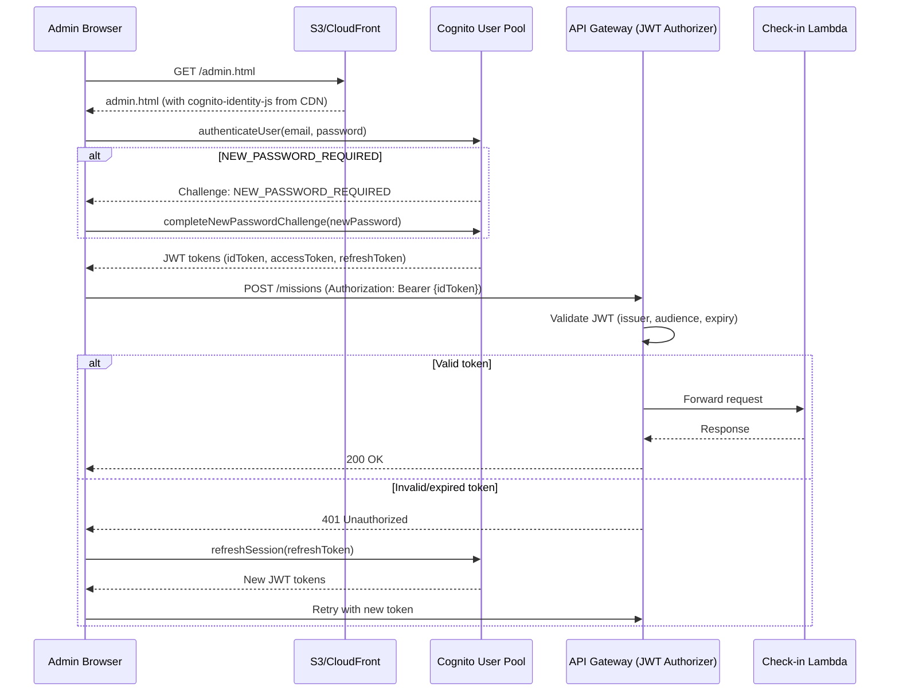
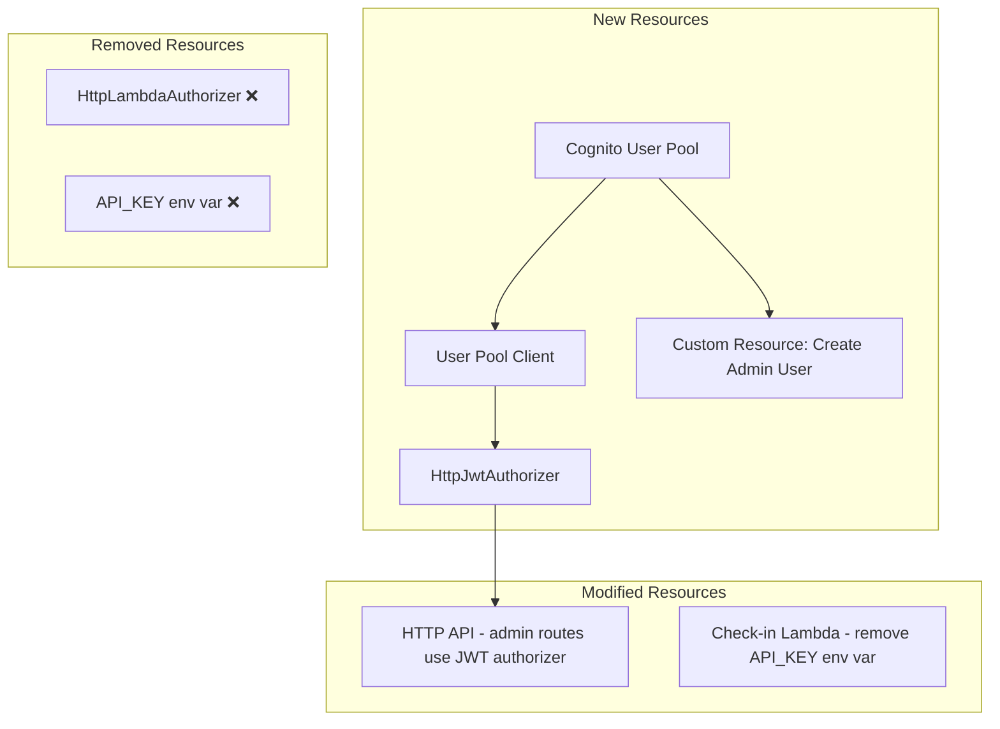
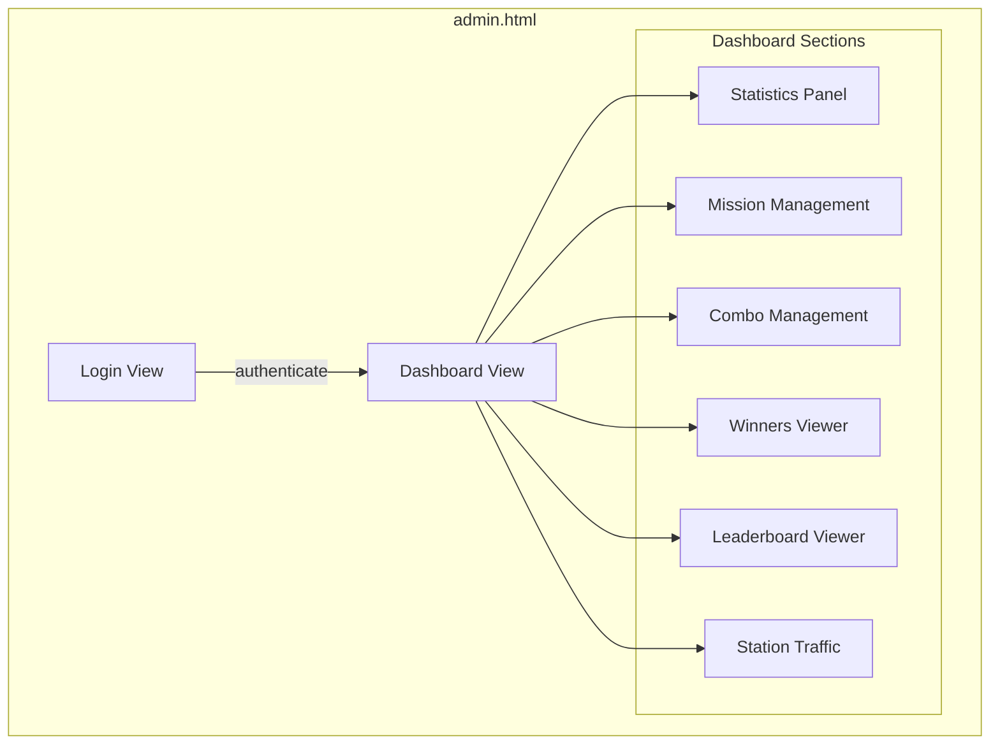

# Design Document: Cognito Admin Dashboard

## Overview

This feature migrates admin route authentication from a Lambda-based API key authorizer to an Amazon Cognito JWT authorizer, and introduces a single-page admin dashboard (admin.html) for managing the Signal Hunt event. The dashboard uses the `amazon-cognito-identity-js` SDK loaded from CDN for embedded login, and provides management UIs for missions, combos, winners, leaderboard, and station traffic — all styled with the existing dark sci-fi aesthetic.

### Key Design Decisions

1. **Cognito User Pool with email sign-in** — A dedicated User Pool with email as the sole sign-in attribute. No hosted UI; authentication is handled entirely within the admin.html page using the Cognito Identity JS SDK.
2. **HttpJwtAuthorizer at API Gateway** — Replaces the Lambda authorizer. JWT validation happens at the gateway layer, eliminating the need for in-Lambda API key checks and reducing latency on admin routes.
3. **Single-page HTML with inline assets** — Matches the existing check-in page pattern. All CSS and JS are inline in admin.html, deployed to the same S3 bucket via the existing BucketDeployment.
4. **Token storage in memory** — JWT tokens are stored in JavaScript variables (not localStorage) for security. Refresh tokens enable silent re-authentication when the ID token expires.
5. **Pre-created admin user via Custom Resource** — A CDK custom resource (AwsCustomResource) creates the admin user with a verified email on deployment, avoiding manual setup.

## Architecture

### Authentication Flow



### CDK Stack Changes



### Admin Dashboard Page Structure



## Components and Interfaces

### 1. CDK Infrastructure Changes (infra/lib/signal-hunt-stack.ts)

#### New Constructs

```typescript
import * as cognito from 'aws-cdk-lib/aws-cognito';
import { HttpJwtAuthorizer } from 'aws-cdk-lib/aws-apigatewayv2-authorizers';
import * as cr from 'aws-cdk-lib/custom-resources';

// Cognito User Pool
const userPool = new cognito.UserPool(this, 'AdminUserPool', {
  userPoolName: 'signal-hunt-admin-pool',
  signInAliases: { email: true },
  selfSignUpEnabled: false,
  passwordPolicy: {
    minLength: 8,
    requireLowercase: true,
    requireUppercase: true,
    requireDigits: true,
    requireSymbols: false,
  },
  removalPolicy: cdk.RemovalPolicy.DESTROY,
});

// User Pool Client (no secret, USER_PASSWORD_AUTH flow)
const userPoolClient = new cognito.UserPoolClient(this, 'AdminUserPoolClient', {
  userPool,
  userPoolClientName: 'signal-hunt-admin-client',
  authFlows: {
    userPassword: true,
    userSrp: true,
  },
  generateSecret: false,
});

// JWT Authorizer
const jwtAuthorizer = new HttpJwtAuthorizer('CognitoAuthorizer', 
  `https://cognito-idp.${this.region}.amazonaws.com/${userPool.userPoolId}`,
  {
    jwtAudience: [userPoolClient.userPoolClientId],
    identitySource: '$request.header.Authorization',
  }
);

// Custom Resource: Create admin user with verified email
const createAdminUser = new cr.AwsCustomResource(this, 'CreateAdminUser', {
  onCreate: {
    service: 'CognitoIdentityServiceProvider',
    action: 'adminCreateUser',
    parameters: {
      UserPoolId: userPool.userPoolId,
      Username: adminEmail,
      UserAttributes: [
        { Name: 'email', Value: adminEmail },
        { Name: 'email_verified', Value: 'true' },
      ],
      MessageAction: 'SUPPRESS',
    },
    physicalResourceId: cr.PhysicalResourceId.of('admin-user-creation'),
  },
  policy: cr.AwsCustomResourcePolicy.fromSdkCalls({
    resources: [userPool.userPoolArn],
  }),
});
```

#### Removed Constructs

- `HttpLambdaAuthorizer` ('AdminAuthorizer') — replaced by `HttpJwtAuthorizer`
- `API_KEY` environment variable from `checkinHandler`
- Import of `HttpLambdaAuthorizer` and `HttpLambdaResponseType`

#### Modified Routes

All admin routes switch from `adminAuthorizer` to `jwtAuthorizer`:

```typescript
// Admin routes now use JWT authorizer
httpApi.addRoutes({
  path: '/missions',
  methods: [apigatewayv2.HttpMethod.POST],
  integration: checkinIntegration,
  authorizer: jwtAuthorizer,
});
// ... same for GET/PUT/DELETE /missions/*, POST /combos
```

#### Stack Outputs (new)

```typescript
new cdk.CfnOutput(this, 'UserPoolId', {
  value: userPool.userPoolId,
  description: 'Cognito User Pool ID',
});

new cdk.CfnOutput(this, 'UserPoolClientId', {
  value: userPoolClient.userPoolClientId,
  description: 'Cognito User Pool Client ID',
});
```

### 2. Lambda Code Changes

#### router.mjs — Remove API Key Auth

```javascript
// REMOVE: import of validateApiKey
// REMOVE: isAdminRoute() function
// REMOVE: the if (isAdminRoute(method, path)) { ... } block

// The router simply dispatches to handlers without auth checks.
// JWT validation is handled by API Gateway before the Lambda is invoked.
```

#### validator.mjs — Remove validateApiKey

```javascript
// REMOVE: the entire validateApiKey() function export
// All other validation functions remain unchanged.
```

### 3. Admin Dashboard (admin.html)

#### Page Structure

The admin.html file follows the single-page pattern with inline CSS and JS:

```html
<!DOCTYPE html>
<html lang="en">
<head>
  <meta charset="UTF-8" />
  <meta name="viewport" content="width=device-width, initial-scale=1.0" />
  <title>Admin | Signal Hunt</title>
  <link href="https://fonts.googleapis.com/css2?family=Share+Tech+Mono&family=Inter:wght@400;600;700&display=swap" rel="stylesheet" />
  <script src="https://unpkg.com/amazon-cognito-identity-js@6/dist/amazon-cognito-identity.min.js"></script>
  <style>/* Inline CSS — dark sci-fi theme */</style>
</head>
<body>
  <div id="app">
    <div id="login-view"><!-- Login form --></div>
    <div id="dashboard-view" style="display:none">
      <nav><!-- Section navigation tabs --></nav>
      <section id="stats-section"><!-- Statistics --></section>
      <section id="missions-section"><!-- Mission CRUD --></section>
      <section id="combos-section"><!-- Combo management --></section>
      <section id="winners-section"><!-- Winners viewer --></section>
      <section id="leaderboard-section"><!-- Leaderboard --></section>
      <section id="traffic-section"><!-- Station traffic --></section>
    </div>
  </div>
  <script>/* Inline JavaScript — auth, API calls, UI logic */</script>
</body>
</html>
```

#### JavaScript Module Structure (inline)

The inline JavaScript is organized into logical sections:

```javascript
// ===== CONFIGURATION =====
const CONFIG = {
  REGION: 'ap-northeast-1',
  USER_POOL_ID: '/* injected at build or hardcoded after deploy */',
  CLIENT_ID: '/* injected at build or hardcoded after deploy */',
  API_BASE: '' // relative path, same origin via CloudFront
};

// ===== AUTH MODULE =====
// - initCognito(): creates CognitoUserPool instance
// - login(email, password): authenticates, handles NEW_PASSWORD_REQUIRED
// - completeNewPassword(newPassword): completes challenge
// - refreshToken(): refreshes expired ID token
// - logout(): clears session
// - getIdToken(): returns current valid ID token
// - isAuthenticated(): checks if session is valid

// ===== API MODULE =====
// - apiGet(path): GET with optional JWT header
// - apiPost(path, body): POST with JWT header
// - apiPut(path, body): PUT with JWT header
// - apiDelete(path): DELETE with JWT header
// All admin requests include: Authorization: Bearer {idToken}
// On 401 response: attempt token refresh, retry once

// ===== UI MODULE =====
// - showView(viewId): toggles login/dashboard visibility
// - showSection(sectionId): shows active dashboard section
// - renderStats(data): renders statistics panel
// - renderMissions(missions): renders mission list
// - renderMissionForm(type): shows type-specific form fields
// - renderCombos(combos): renders combo list
// - renderWinners(winners): renders winner list
// - renderLeaderboard(entries): renders leaderboard table
// - renderTraffic(stations): renders station traffic
// - formatElapsedTime(seconds): converts seconds to MM:SS format
// - showLoading(container): shows loading indicator
// - showError(container, message, retryFn): shows error with retry
```

#### API Request Flow

```javascript
async function apiRequest(method, path, body = null) {
  const token = getIdToken();
  const isAdminPath = isAdminEndpoint(method, path);
  
  const headers = { 'Content-Type': 'application/json' };
  if (isAdminPath && token) {
    headers['Authorization'] = `Bearer ${token}`;
  }

  const response = await fetch(CONFIG.API_BASE + path, {
    method,
    headers,
    body: body ? JSON.stringify(body) : undefined,
  });

  if (response.status === 401 && isAdminPath) {
    // Attempt token refresh
    const refreshed = await refreshToken();
    if (refreshed) {
      headers['Authorization'] = `Bearer ${getIdToken()}`;
      return fetch(CONFIG.API_BASE + path, { method, headers, body: body ? JSON.stringify(body) : undefined });
    }
    // Refresh failed — show login
    logout();
    showView('login-view');
    throw new Error('Session expired');
  }

  return response;
}

function isAdminEndpoint(method, path) {
  if (path.startsWith('/missions') && ['POST', 'PUT', 'DELETE'].includes(method)) return true;
  if (path === '/missions' && method === 'GET') return true;
  if (path.match(/^\/missions\/[^/]+$/) && method === 'GET') return true;
  if (path === '/combos' && method === 'POST') return true;
  return false;
}
```

#### Statistics Aggregation Logic

```javascript
function computeStats(stationsData, leaderboardData) {
  const totalCheckins = stationsData.stations.reduce((sum, s) => sum + s.uniqueVisitors, 0);
  const uniqueVisitors = stationsData.stations.reduce((max, s) => Math.max(max, s.uniqueVisitors), 0);
  const stampRallyCompletions = leaderboardData.totalEntries || 0;
  // Active missions count fetched from GET /missions (admin endpoint)
  return { totalCheckins, uniqueVisitors, stampRallyCompletions };
}
```

#### Mission Type Field Mapping

```javascript
const MISSION_TYPE_FIELDS = {
  numbered_visit: ['milestones'],
  lucky_draw: ['winnerCount', 'prizeDescription'],
  early_bird: ['winnerCount', 'bonusPoints'],
  last_call: ['winnerCount', 'bonusPoints'],
};

function getVisibleFields(missionType) {
  const commonFields = ['name', 'stationId', 'startTime', 'endTime'];
  const typeFields = MISSION_TYPE_FIELDS[missionType] || [];
  return [...commonFields, ...typeFields];
}
```

#### Elapsed Time Formatting

```javascript
function formatElapsedTime(totalSeconds) {
  const minutes = Math.floor(totalSeconds / 60);
  const seconds = totalSeconds % 60;
  return `${minutes}:${String(seconds).padStart(2, '0')}`;
}
```

#### Mission Action Availability

```javascript
function getMissionActions(mission) {
  const canEdit = mission.status === 'scheduled';
  const canDelete = mission.status === 'scheduled';
  return { canEdit, canDelete };
}
```

## Data Models

### No New DynamoDB Changes

This feature does not modify the DynamoDB table schema. All data access patterns remain the same. The only data-layer change is that the Lambda no longer reads `process.env.API_KEY`.

### Cognito User Pool Configuration

| Attribute | Value |
|-----------|-------|
| Sign-in aliases | email |
| Self sign-up | disabled |
| Password policy | min 8, lowercase + uppercase + digits |
| MFA | none (single admin user) |
| Client auth flows | USER_PASSWORD_AUTH, USER_SRP_AUTH |
| Client secret | none |
| Token validity | ID: 1 hour, Access: 1 hour, Refresh: 30 days |

### Admin User

| Attribute | Value |
|-----------|-------|
| Email | (configured via `adminEmail` context / `ADMIN_EMAIL` env var) |
| Email verified | true |
| Initial state | FORCE_CHANGE_PASSWORD (requires NEW_PASSWORD_REQUIRED flow on first login) |

### Token Storage (Browser Memory)

```javascript
let currentSession = {
  idToken: null,      // JWT ID token (sent in Authorization header)
  accessToken: null,  // JWT access token (not used directly)
  refreshToken: null, // Refresh token (used for silent re-auth)
};
```

## Error Handling

### Authentication Errors

| Scenario | Cognito Error | UI Behavior |
|----------|--------------|-------------|
| Wrong password | NotAuthorizedException | Display "Incorrect email or password" |
| User not found | UserNotFoundException | Display "Incorrect email or password" (same message for security) |
| Account locked | TooManyRequestsException | Display "Too many attempts. Please try again later." |
| New password required | NEW_PASSWORD_REQUIRED challenge | Show new password form |
| Network error | fetch failure | Display "Network error. Check your connection." |

### API Request Errors

| HTTP Status | Handling |
|-------------|----------|
| 401 | Attempt token refresh → retry. If refresh fails, redirect to login. |
| 400 | Display validation error message from response body |
| 404 | Display "Resource not found" |
| 409 | Display "Cannot modify active/completed mission" |
| 500 | Display "Server error. Please try again." with retry button |
| Network failure | Display "Network error" with retry button |

### Token Refresh Strategy

1. On any 401 response from an admin endpoint:
   - Call `cognitoUser.refreshSession(refreshToken, callback)`
   - If successful: update stored tokens, retry the original request once
   - If failed: clear session, show login view
2. Proactive refresh: before making a request, check if ID token expires within 5 minutes. If so, refresh preemptively.

## Correctness Properties

*A property is a characteristic or behavior that should hold true across all valid executions of a system — essentially, a formal statement about what the system should do. Properties serve as the bridge between human-readable specifications and machine-verifiable correctness guarantees.*

### Property 1: Admin API requests include JWT token

*For any* API request made by the dashboard to an admin endpoint (POST/PUT/DELETE /missions/*, GET /missions, GET /missions/{id}, POST /combos) while the user is authenticated, the request SHALL include an Authorization header with the value `Bearer {idToken}` where idToken is the current valid Cognito ID token.

**Validates: Requirements 3.6**

### Property 2: Statistics aggregation correctness

*For any* valid stations API response containing an array of station objects with uniqueVisitors counts, and any valid leaderboard API response with totalEntries, the computed statistics SHALL produce totalCheckins equal to the sum of all uniqueVisitors values, and stampRallyCompletions equal to totalEntries.

**Validates: Requirements 4.1**

### Property 3: Mission type determines visible form fields

*For any* mission type selected from {numbered_visit, lucky_draw, early_bird, last_call}, the create/edit form SHALL display exactly the common fields (name, stationId, startTime, endTime) plus the type-specific fields: milestones for numbered_visit, winnerCount and prizeDescription for lucky_draw, winnerCount and bonusPoints for early_bird, winnerCount and bonusPoints for last_call.

**Validates: Requirements 5.3**

### Property 4: Mission actions disabled by status

*For any* mission with status "active" or "completed", the edit and delete actions SHALL be disabled (not clickable). For any mission with status "scheduled", both edit and delete actions SHALL be enabled.

**Validates: Requirements 5.9**

### Property 5: Elapsed time formatting

*For any* non-negative integer representing elapsed seconds, the formatElapsedTime function SHALL produce a string in the format `M:SS` where M is floor(seconds/60) and SS is (seconds % 60) zero-padded to 2 digits.

**Validates: Requirements 8.2**

### Property 6: Mission list rendering completeness

*For any* mission object containing name, type, stationId, status, startTime, and endTime fields, the rendered mission list item SHALL display all six of these values.

**Validates: Requirements 5.1**

### Property 7: Combo list rendering completeness

*For any* combo object containing name, stations (array), and reward fields, the rendered combo list item SHALL display the combo name, all station identifiers, and the reward description.

**Validates: Requirements 6.1**

### Property 8: Winner rendering completeness

*For any* winner object containing tagId and awardTimestamp fields, the rendered winner list item SHALL display both the tag ID and the award timestamp.

**Validates: Requirements 7.3**

## Testing Strategy

### Testing Approach

This feature is primarily a frontend (single-page HTML) and infrastructure (CDK) change. The testable logic is concentrated in:

1. **Pure JavaScript functions** — `formatElapsedTime`, `computeStats`, `getVisibleFields`, `getMissionActions`, `isAdminEndpoint`
2. **CDK assertions** — Verify the synthesized CloudFormation template contains correct Cognito, JWT authorizer, and output resources
3. **Integration tests** — Verify the deployed system accepts/rejects tokens correctly

### Property-Based Testing Configuration

- **Library**: `fast-check` (npm package)
- **Runner**: Vitest
- **Iterations**: Minimum 100 per property
- **Tag format**: `Feature: cognito-admin-dashboard, Property {N}: {title}`

### Test File Organization

```
lambda/checkin/
├── __tests__/
│   ├── properties/
│   │   └── admin-dashboard.property.test.mjs   # Properties 1-8
│   └── unit/
│       └── admin-dashboard.test.mjs            # Example-based tests
infra/
├── __tests__/
│   └── cognito-stack.test.ts                   # CDK assertion tests
```

### Extractable Pure Functions for Testing

The inline JavaScript functions that are testable as properties should be extracted into a testable module or tested via their logic equivalents:

```javascript
// These functions have clear input/output behavior suitable for PBT:
formatElapsedTime(seconds)        // Property 5
computeStats(stationsData, leaderboardData)  // Property 2
getVisibleFields(missionType)     // Property 3
getMissionActions(mission)        // Property 4
isAdminEndpoint(method, path)     // Property 1
```

### CDK Assertion Tests (Example-Based)

```typescript
// Verify User Pool exists with email sign-in
// Verify User Pool Client has USER_PASSWORD_AUTH, no secret
// Verify JWT Authorizer references correct issuer URL and audience
// Verify admin routes use JWT authorizer
// Verify API_KEY env var is removed from Lambda
// Verify stack outputs include UserPoolId and UserPoolClientId
```
