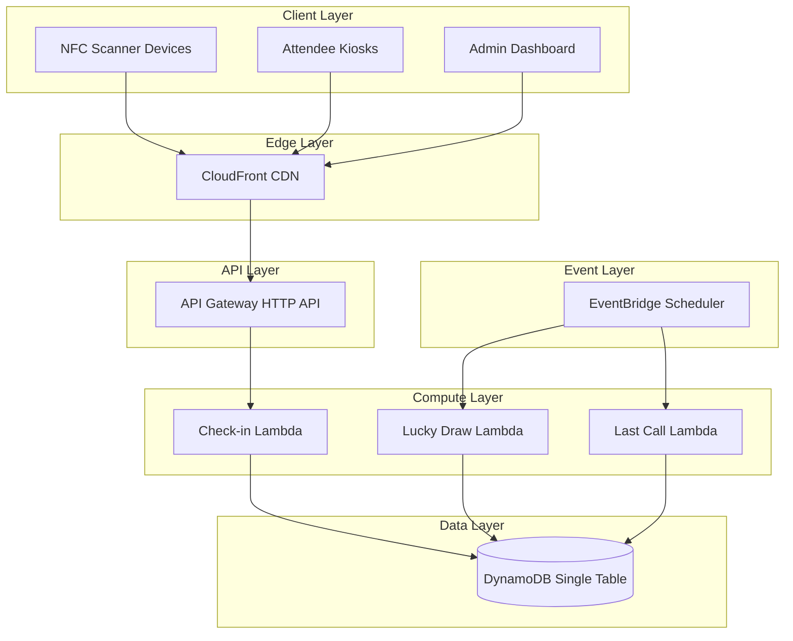
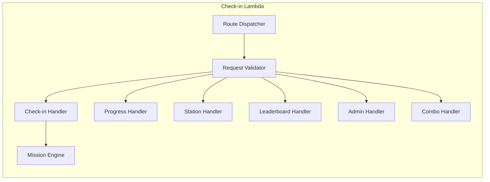
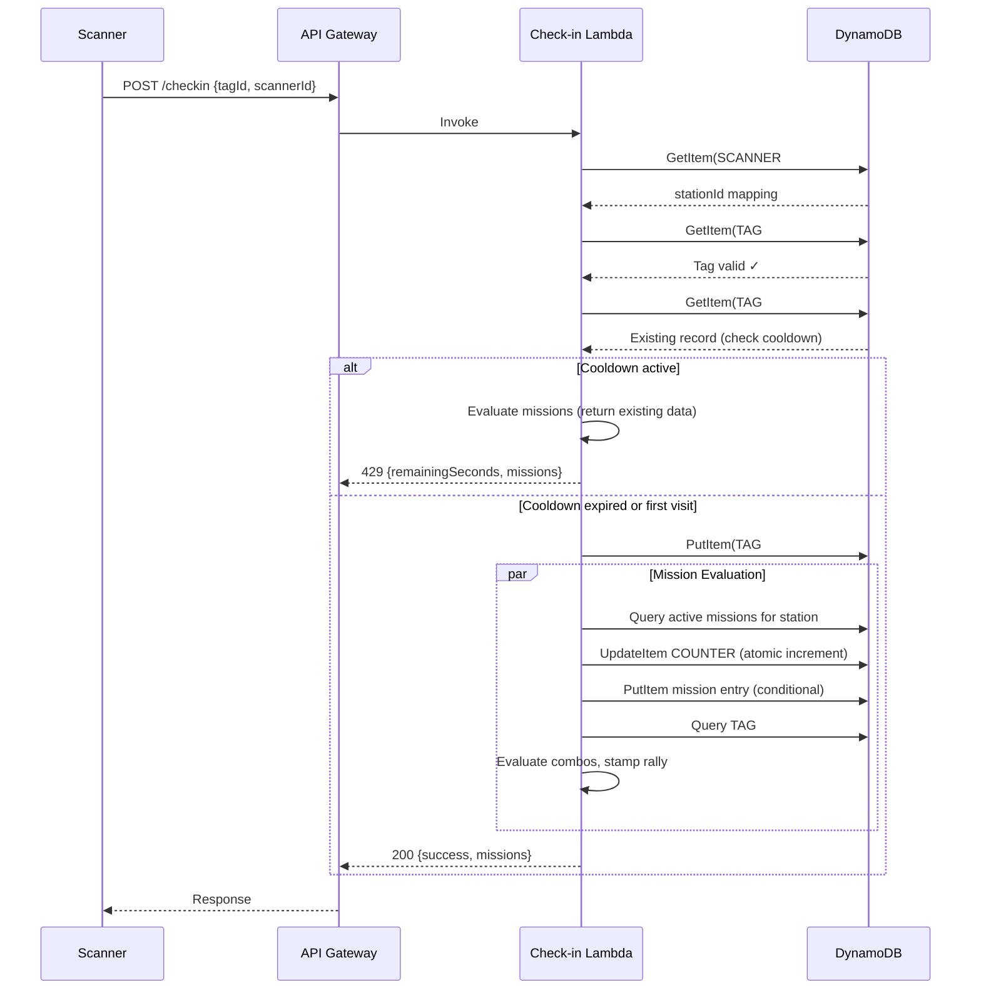
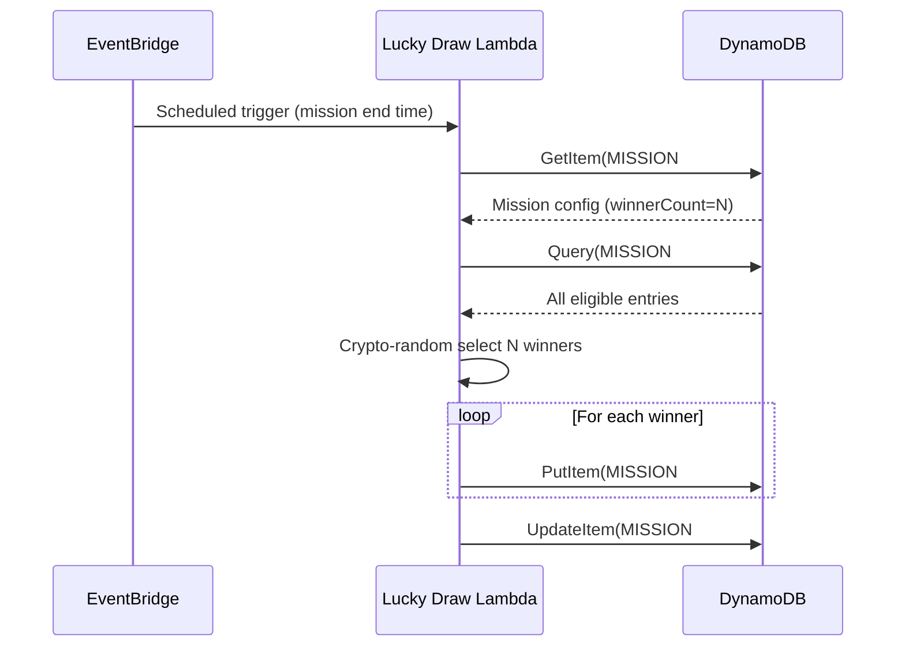
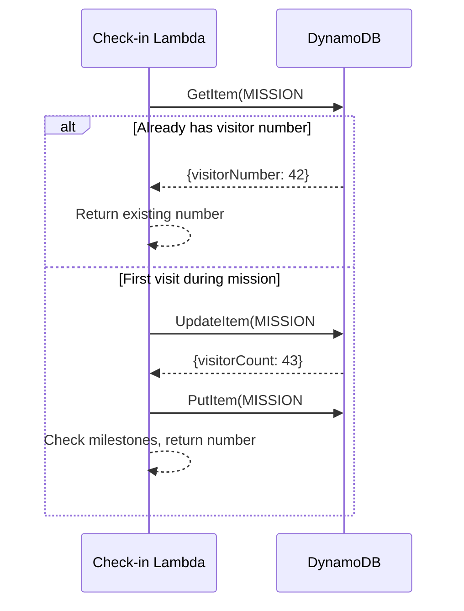

# Design Document: NFC Check-in Backend

## Overview

The NFC Check-in Backend is a serverless system built on AWS that powers the "Signal Over Noise" community day event. It processes NFC badge taps at exhibitor booths, records visit data, and drives attendee engagement through gamification features including numbered visit missions, lucky draws, stamp rally completion, combo bonuses, speed challenge leaderboards, and time-based bonuses.

The system is designed for a single-day event with up to 500 attendees, 10 stations, and up to 5000 check-ins per station. It prioritizes low latency (500ms for check-ins), cost efficiency (serverless, pay-per-request), and operational simplicity (single Lambda, single DynamoDB table).

### Key Design Decisions

1. **Single-table DynamoDB design** — All entities (check-ins, missions, combos, leaderboard, tag registry) share one table with composite keys and GSIs. This minimizes cost and simplifies IAM.
2. **Single Lambda with route-based dispatch** — One Lambda function handles all API routes, reducing cold starts and deployment complexity for this event-scoped system.
3. **Mission evaluation at check-in time** — Missions are evaluated synchronously during check-in processing to provide immediate feedback in the response. This is feasible given the bounded data volume.
4. **EventBridge for deferred processing** — Lucky draw winner selection and Last Call finalization use scheduled EventBridge rules to trigger processing at mission end times.
5. **Atomic counters for concurrency** — DynamoDB atomic increments guarantee unique sequence numbers under concurrent check-in conditions.

## Architecture

### System Architecture Diagram



### Request Flow Summary

| Flow | Path | Auth | Latency Target |
|------|------|------|----------------|
| NFC Check-in | POST /checkin | None | 500ms |
| Progress Query | GET /checkin/{tagId} | None | 3s |
| Station Traffic | GET /stations/{stationId} | None | 3s |
| Station Summary | GET /stations | None | 3s |
| Leaderboard | GET /leaderboard | None | 3s |
| Mission CRUD | POST/GET/PUT/DELETE /missions/* | API Key | 2s |
| Combo CRUD | POST/GET /combos | API Key | 2s |
| Mission Winners | GET /missions/{missionId}/winners | None | 3s |

## Components and Interfaces

### API Endpoints

#### 1. Check-in Endpoint

```
POST /checkin
Content-Type: application/json

Request Body:
{
  "tagId": "string",       // NFC tag identifier
  "scannerId": "string"   // Scanner device identifier
}

Success Response (200):
{
  "success": true,
  "tagId": "string",
  "stationId": number,
  "checkinTime": "ISO8601",
  "missions": {
    "numberedVisit": [
      {
        "missionId": "string",
        "visitorNumber": number,
        "isMilestone": boolean,
        "milestoneMessage": "string | null"
      }
    ],
    "earlyBird": {
      "missionId": "string",
      "position": number,
      "bonusPoints": number
    } | null,
    "comboCompleted": [
      {
        "comboName": "string",
        "reward": "string",
        "stations": [number]
      }
    ],
    "stampRally": {
      "completed": boolean,
      "rewardCode": "string | null"
    }
  }
}

Cooldown Response (429):
{
  "error": "cooldown_active",
  "remainingSeconds": number,
  "missions": { ... }  // Mission data still included
}

Error Responses:
- 400: Missing fields, invalid scanner
- 404: Unrecognized NFC tag
- 500: Internal failure
```

#### 2. Progress Query Endpoint

```
GET /checkin/{tagId}

Response (200):
{
  "tagId": "string",
  "totalCheckins": number,
  "completed": boolean,
  "rewardCode": "string | null",
  "stations": [
    {
      "stationId": number,
      "checkinTime": "ISO8601"
    }
  ]
}
```

#### 3. Station Traffic Endpoint

```
GET /stations/{stationId}

Response (200):
{
  "stationId": number,
  "uniqueVisitors": number,
  "recentCheckins": ["ISO8601"]  // Up to 1000, descending
}

GET /stations

Response (200):
{
  "stations": [
    { "stationId": number, "uniqueVisitors": number }
  ]
}
```

#### 4. Leaderboard Endpoint

```
GET /leaderboard

Response (200):
{
  "entries": [
    {
      "maskedTagId": "abcd****wxyz",
      "elapsedSeconds": number,
      "completedAt": "ISO8601"
    }
  ],
  "totalEntries": number
}
```

#### 5. Mission Administration Endpoints

```
POST /missions
Authorization: Bearer {api-key}

Request Body:
{
  "type": "numbered_visit" | "lucky_draw" | "early_bird" | "last_call",
  "name": "string",
  "startTime": "ISO8601",
  "endTime": "ISO8601",
  "stationId": number,
  // Type-specific fields:
  "milestones": [number],           // numbered_visit
  "winnerCount": number,            // lucky_draw, early_bird, last_call
  "prizeDescription": "string",     // lucky_draw
  "bonusPoints": number             // early_bird, last_call
}

Response (201):
{
  "missionId": "string",
  "type": "string",
  "name": "string",
  "status": "scheduled",
  ...
}

GET /missions
GET /missions/{missionId}
PUT /missions/{missionId}
DELETE /missions/{missionId}
```

#### 6. Combo Bonus Endpoints

```
POST /combos
Authorization: Bearer {api-key}

Request Body:
{
  "name": "string",
  "stations": [number],
  "reward": "string"
}

GET /combos
```

### Internal Components



#### Mission Engine Sub-components

| Component | Responsibility |
|-----------|---------------|
| `MissionEvaluator` | Orchestrates mission evaluation for a check-in |
| `NumberedVisitProcessor` | Assigns sequence numbers via atomic counter |
| `LuckyDrawRecorder` | Records eligible entries for active draws |
| `EarlyBirdProcessor` | Awards bonus to first N visitors |
| `LastCallRecorder` | Maintains sliding window of recent N visitors |
| `ComboEvaluator` | Checks if check-in completes any combo set |
| `StampRallyEvaluator` | Checks if all 10 stations are visited |
| `LeaderboardUpdater` | Calculates elapsed time and updates leaderboard |

## Data Models

### DynamoDB Single-Table Design

The system uses a single DynamoDB table with a flexible key schema to store all entity types. This approach minimizes cost (one table, one set of GSIs) and simplifies operations.

**Table: SignalHuntTable**

| Attribute | Type | Description |
|-----------|------|-------------|
| `PK` | String | Partition key (entity-prefixed) |
| `SK` | String | Sort key (entity-prefixed) |
| `GSI1PK` | String | GSI1 partition key |
| `GSI1SK` | String | GSI1 sort key |
| `GSI2PK` | String | GSI2 partition key |
| `GSI2SK` | String | GSI2 sort key |
| `ttl` | Number | TTL epoch seconds |
| `data` | Map | Entity-specific attributes |

### Entity Key Patterns

| Entity | PK | SK | GSI1PK | GSI1SK |
|--------|----|----|--------|--------|
| Check-in | `TAG#{tagId}` | `CHECKIN#{stationId}` | `STATION#{stationId}` | `CHECKIN#{timestamp}` |
| NFC Tag Registry | `TAG#{tagId}` | `REGISTRY` | — | — |
| Mission Config | `MISSION#{missionId}` | `CONFIG` | `MISSION_TYPE#{type}` | `{startTime}` |
| Mission Counter | `MISSION#{missionId}` | `COUNTER` | — | — |
| Mission Entry | `MISSION#{missionId}` | `ENTRY#{tagId}` | `TAG#{tagId}` | `MISSION#{missionId}` |
| Mission Winner | `MISSION#{missionId}` | `WINNER#{tagId}` | — | — |
| Early Bird Slot | `MISSION#{missionId}` | `EARLYBIRD#{position}` | — | — |
| Last Call Window | `MISSION#{missionId}` | `LASTCALL#{tagId}` | — | — |
| Combo Config | `COMBO#{comboName}` | `CONFIG` | `COMBO_LIST` | `{comboName}` |
| Combo Award | `TAG#{tagId}` | `COMBO#{comboName}` | — | — |
| Stamp Rally | `TAG#{tagId}` | `STAMPRALLY` | — | — |
| Leaderboard Entry | `LEADERBOARD` | `ENTRY#{elapsedSeconds}#{tagId}` | — | — |
| Scanner Mapping | `SCANNER#{scannerId}` | `CONFIG` | — | — |

### GSI Definitions

| GSI | Partition Key | Sort Key | Purpose |
|-----|--------------|----------|---------|
| GSI1 | `GSI1PK` | `GSI1SK` | Station traffic queries, mission lookups by type, tag mission entries |
| GSI2 | `GSI2PK` | `GSI2SK` | Reserved for future access patterns |

### Access Patterns

| Access Pattern | Operation | Key Condition |
|----------------|-----------|---------------|
| Get check-ins for a tag | Query | PK = `TAG#{tagId}`, SK begins_with `CHECKIN#` |
| Validate NFC tag | GetItem | PK = `TAG#{tagId}`, SK = `REGISTRY` |
| Get station traffic | Query GSI1 | GSI1PK = `STATION#{stationId}`, GSI1SK begins_with `CHECKIN#` |
| Get active missions for station | Query | PK = `MISSION_TYPE#{type}`, filter by station and time |
| Get mission config | GetItem | PK = `MISSION#{missionId}`, SK = `CONFIG` |
| Increment mission counter | UpdateItem (atomic) | PK = `MISSION#{missionId}`, SK = `COUNTER` |
| Record mission entry | PutItem (conditional) | PK = `MISSION#{missionId}`, SK = `ENTRY#{tagId}` |
| Get mission entries | Query | PK = `MISSION#{missionId}`, SK begins_with `ENTRY#` |
| Get mission winners | Query | PK = `MISSION#{missionId}`, SK begins_with `WINNER#` |
| Check combo award | GetItem | PK = `TAG#{tagId}`, SK = `COMBO#{comboName}` |
| Get all combos | Query GSI1 | GSI1PK = `COMBO_LIST` |
| Get leaderboard | Query | PK = `LEADERBOARD`, SK begins_with `ENTRY#`, Limit 20 |
| Get stamp rally status | GetItem | PK = `TAG#{tagId}`, SK = `STAMPRALLY` |
| Map scanner to station | GetItem | PK = `SCANNER#{scannerId}`, SK = `CONFIG` |

### Key Sequence Diagrams

#### Check-in Flow with Mission Evaluation



#### Lucky Draw Winner Selection Flow



#### Numbered Visit Atomic Counter Flow



### Concurrency Handling

| Scenario | Mechanism | Guarantee |
|----------|-----------|-----------|
| Numbered visit sequence | DynamoDB `ADD` (atomic increment) | No duplicate sequence numbers |
| Duplicate check-in prevention | Conditional PutItem (`attribute_not_exists`) | At-most-once within cooldown |
| Early Bird slot allocation | Atomic counter + conditional write | Exactly N winners |
| Combo/Stamp Rally award | Conditional PutItem on award record | At-most-once award |
| Lucky Draw entry | Conditional PutItem (`attribute_not_exists`) | One entry per tag per mission |

## Correctness Properties

*A property is a characteristic or behavior that should hold true across all valid executions of a system — essentially, a formal statement about what the system should do. Properties serve as the bridge between human-readable specifications and machine-verifiable correctness guarantees.*

### Property 1: Check-in record creation round trip

*For any* valid NFC tag identifier and valid scanner identifier, when a check-in is processed, the returned response and the persisted record SHALL contain the same tag identifier, the correctly mapped station identifier (1–10), and a valid ISO 8601 UTC timestamp.

**Validates: Requirements 1.1, 1.2**

### Property 2: Missing field validation

*For any* check-in request where the tagId field, the scannerId field, or both are missing or empty, the system SHALL return a 400 error response that identifies which specific field is missing.

**Validates: Requirements 1.3**

### Property 3: Unregistered tag rejection

*For any* tag identifier that does not exist in the NFC tag registry, the system SHALL return a 404 error response regardless of the scanner identifier provided.

**Validates: Requirements 1.4**

### Property 4: Cooldown remaining time calculation

*For any* NFC tag and station where a successful check-in occurred at time T1, and a subsequent check-in attempt occurs at time T2 where (T2 - T1) < 30 seconds, the system SHALL return a 429 response with remainingSeconds equal to 30 - floor(T2 - T1).

**Validates: Requirements 1.5**

### Property 5: Invalid scanner rejection

*For any* scanner identifier that does not map to a station identifier in the range 1–10, the system SHALL return a 400 error response indicating the scanner is unrecognized.

**Validates: Requirements 1.6**

### Property 6: Progress query correctness

*For any* NFC tag with a set of check-in records at stations S, the progress query SHALL return stations sorted by station identifier in ascending order, a totalCheckins value equal to |S|, and a completed boolean equal to (|S| == 10).

**Validates: Requirements 2.1, 2.2**

### Property 7: Progress query input validation

*For any* tag identifier that is an empty string or consists only of whitespace, the progress query SHALL return an error response.

**Validates: Requirements 2.4**

### Property 8: Station traffic sort order and limit

*For any* station with N check-in records, the station traffic query SHALL return timestamps sorted in descending chronological order, with the result set limited to min(N, 1000) entries.

**Validates: Requirements 3.1**

### Property 9: Station summary aggregation

*For any* set of check-in records distributed across stations 1–10, the station summary query SHALL return exactly 10 entries where each entry's unique visitor count equals the number of distinct tag identifiers that checked in at that station.

**Validates: Requirements 3.2**

### Property 10: Station identifier validation

*For any* value that is not an integer between 1 and 10 (inclusive), the station traffic query SHALL return an error response without querying the data store.

**Validates: Requirements 3.3**

### Property 11: Numbered visit sequential uniqueness

*For any* set of N distinct NFC tags checking in at a station during an active Numbered Visit Mission (including under concurrent conditions), the assigned visitor numbers SHALL form exactly the set {1, 2, ..., N} with no duplicates and no gaps.

**Validates: Requirements 4.2, 4.6**

### Property 12: Numbered visit idempotency

*For any* NFC tag that has already been assigned a visitor number V for a Numbered Visit Mission, all subsequent check-ins by that tag at the same station during that mission SHALL return the same visitor number V without incrementing the sequence counter.

**Validates: Requirements 4.3**

### Property 13: Milestone detection

*For any* Numbered Visit Mission with milestone list M and a check-in that results in visitor number V, the response SHALL include a milestone notification if and only if V ∈ M.

**Validates: Requirements 4.4**

### Property 14: Independent mission counters

*For any* two Numbered Visit Missions active simultaneously at the same station, their sequence counters SHALL be independent — a check-in that increments one mission's counter SHALL NOT affect the other mission's counter.

**Validates: Requirements 4.7**

### Property 15: Lucky draw validation

*For any* Lucky Draw creation request where winner count N < 1 or N > 100, or start time ≥ end time, or prize description exceeds 500 characters, the system SHALL reject the request with an error identifying the invalid field.

**Validates: Requirements 5.2**

### Property 16: Lucky draw entry uniqueness

*For any* NFC tag checking in multiple times at a station during an active Lucky Draw mission, exactly one eligible entry SHALL be recorded for that tag for that mission.

**Validates: Requirements 5.3**

### Property 17: Lucky draw winner selection with insufficient entries

*For any* Lucky Draw mission where the number of eligible entries E is less than the configured winner count N, the winner selection SHALL select all E entries as winners and record E as the actual winner count.

**Validates: Requirements 5.6**

### Property 18: Stamp rally completion and idempotency

*For any* NFC tag, when the set of visited stations first reaches all 10, the system SHALL generate a reward code (≥16 characters, cryptographically random) and mark stamp rally as complete. All subsequent check-ins and progress queries for that tag SHALL return the same reward code without generating a new one.

**Validates: Requirements 6.1, 6.2, 6.3, 6.4**

### Property 19: Combo detection and at-most-once award

*For any* defined Combo Bonus with required station set C and any NFC tag, the combo SHALL be triggered in the check-in response if and only if the tag's visited stations become a superset of C for the first time. Subsequent check-ins SHALL NOT re-trigger the same combo.

**Validates: Requirements 7.3, 7.4**

### Property 20: Combo validation

*For any* Combo Bonus creation request containing a station identifier outside the range 1–10, or containing duplicate station identifiers, the system SHALL reject the request with an error.

**Validates: Requirements 7.2**

### Property 21: Leaderboard elapsed time calculation

*For any* NFC tag that has completed all 10 stations, the elapsed time SHALL equal max(checkinTimestamps) - min(checkinTimestamps) expressed in whole seconds (truncated, not rounded).

**Validates: Requirements 8.1**

### Property 22: Leaderboard sort order

*For any* set of stamp rally completions, the leaderboard SHALL return at most 20 entries sorted by elapsed time in ascending order, with ties broken by earlier completion timestamp first.

**Validates: Requirements 8.2**

### Property 23: Early bird first-N award with idempotency

*For any* Early Bird mission with winner count N at a station, the bonus SHALL be awarded to exactly the first N unique NFC tags that check in after the mission start time. Tags that have already received the bonus SHALL NOT receive it again on subsequent check-ins, and their repeated check-ins SHALL NOT count toward the N winner slots.

**Validates: Requirements 9.2, 9.5, 9.7, 9.8**

### Property 24: Last call sliding window

*For any* Last Call mission with winner count N at a station, the winners SHALL be the last N unique NFC tags (by check-in timestamp) that checked in before the mission end time. If fewer than N unique tags checked in, all of them SHALL be winners.

**Validates: Requirements 9.4, 9.7**

### Property 25: Mission lifecycle state transitions

*For any* mission, updates (PUT) and deletions (DELETE) SHALL succeed only when the mission has not yet started (current time < start time). If the mission is active (start ≤ current < end) or ended (current ≥ end), the system SHALL reject the operation with a 409 error.

**Validates: Requirements 10.4, 10.5, 10.6, 10.7**

### Property 26: Mission parameter validation

*For any* mission creation or update request with missing required fields, end time ≤ start time, or name exceeding 200 characters, the system SHALL reject with a 400 error identifying the invalid parameter.

**Validates: Requirements 10.8**

### Property 27: Admin authentication enforcement

*For any* request to admin endpoints (mission CRUD, combo CRUD) that includes an invalid API key or no API key in the Authorization header, the system SHALL return a 401 error.

**Validates: Requirements 10.9**

### Property 28: TTL calculation

*For any* check-in record created at time T, the TTL attribute SHALL equal floor(T/1000) + 30×24×60×60. For any mission record with end time E, the TTL attribute SHALL equal floor(E/1000) + 30×24×60×60.

**Validates: Requirements 11.1, 11.2**

### Property 29: Expired record filtering

*For any* record whose TTL value is less than the current Unix epoch time, that record SHALL be excluded from all query results regardless of whether DynamoDB has physically deleted it.

**Validates: Requirements 11.4**

## Error Handling

### Error Response Format

All error responses follow a consistent JSON structure:

```json
{
  "error": "error_code",
  "message": "Human-readable description",
  "field": "fieldName"  // Optional: included for validation errors
}
```

### Error Categories

| Category | HTTP Status | Error Code | Trigger |
|----------|-------------|------------|---------|
| Missing required field | 400 | `missing_field` | tagId or scannerId absent |
| Invalid field value | 400 | `invalid_field` | Station out of range, bad mission params |
| Authentication failure | 401 | `unauthorized` | Missing/invalid API key |
| Resource not found | 404 | `not_found` | Unknown tag, unknown mission |
| Cooldown active | 429 | `cooldown_active` | Re-check-in within 30s |
| State conflict | 409 | `conflict` | Modify active/ended mission |
| Internal error | 500 | `internal_error` | DynamoDB failure, unexpected exception |

### Error Handling Strategy

1. **Fail-fast validation**: Validate all inputs before any DynamoDB operations. Return immediately on first validation failure.
2. **Atomic operations**: Use DynamoDB conditional writes to prevent partial state. If a conditional write fails, return appropriate error without side effects.
3. **Idempotent retries**: All write operations are designed to be safely retried. Conditional expressions prevent duplicate records.
4. **Graceful degradation for missions**: If mission evaluation fails (e.g., counter update race condition), the check-in itself still succeeds. Mission results are returned on a best-effort basis with a `missionErrors` field in the response.
5. **Structured logging**: All errors are logged with correlation ID (request ID from API Gateway), error type, and relevant entity identifiers for debugging.

### Retry Strategy

| Operation | Retry Behavior |
|-----------|---------------|
| DynamoDB conditional write (ConditionalCheckFailed) | No retry — indicates expected state (duplicate) |
| DynamoDB throttle (ProvisionedThroughputExceeded) | SDK auto-retry with exponential backoff |
| DynamoDB internal error | SDK auto-retry (up to 3 attempts) |
| Atomic counter increment | No retry needed — atomic operation |

## Testing Strategy

### Testing Approach

The system uses a dual testing approach:

1. **Property-based tests** — Verify universal correctness properties across randomized inputs using `fast-check` (JavaScript PBT library). Each property test runs a minimum of 100 iterations.
2. **Unit tests** — Verify specific examples, edge cases, integration points, and error conditions using a standard test runner (Vitest).
3. **Integration tests** — Verify end-to-end flows against a local DynamoDB instance (DynamoDB Local or docker).

### Property-Based Testing Configuration

- **Library**: `fast-check` (npm package)
- **Runner**: Vitest
- **Iterations**: Minimum 100 per property
- **Tag format**: `Feature: nfc-checkin-backend, Property {N}: {title}`

### Test Categories

| Category | Scope | Examples |
|----------|-------|---------|
| Input validation | Request parsing, field validation | Missing fields, invalid ranges, empty strings |
| Business logic | Cooldown calc, milestone detection, combo matching | Randomized inputs across full domain |
| Data integrity | TTL calculation, sort order, uniqueness | Generated datasets with known properties |
| Concurrency | Atomic counters, conditional writes | Simulated concurrent operations |
| State machines | Mission lifecycle, early bird completion | State transition sequences |

### Mocking Strategy

- **DynamoDB**: Mock the `DynamoDBDocumentClient` for unit/property tests. Use DynamoDB Local for integration tests.
- **Crypto**: Mock `crypto.randomBytes` for deterministic property tests where uniqueness is verified by checking output set size.
- **Time**: Inject clock for deterministic time-based tests (cooldown, mission windows, TTL).

### Test File Organization

```
lambda/checkin/
├── __tests__/
│   ├── properties/           # Property-based tests
│   │   ├── checkin.property.test.mjs
│   │   ├── progress.property.test.mjs
│   │   ├── station.property.test.mjs
│   │   ├── missions.property.test.mjs
│   │   ├── combo.property.test.mjs
│   │   ├── leaderboard.property.test.mjs
│   │   └── ttl.property.test.mjs
│   ├── unit/                 # Example-based unit tests
│   │   ├── checkin.test.mjs
│   │   ├── missions.test.mjs
│   │   └── admin.test.mjs
│   └── integration/          # End-to-end with DynamoDB Local
│       └── flows.integration.test.mjs
├── src/                      # Source modules
│   ├── router.mjs
│   ├── validator.mjs
│   ├── checkin-handler.mjs
│   ├── progress-handler.mjs
│   ├── station-handler.mjs
│   ├── leaderboard-handler.mjs
│   ├── admin-handler.mjs
│   ├── combo-handler.mjs
│   ├── mission-engine/
│   │   ├── evaluator.mjs
│   │   ├── numbered-visit.mjs
│   │   ├── lucky-draw.mjs
│   │   ├── early-bird.mjs
│   │   ├── last-call.mjs
│   │   ├── stamp-rally.mjs
│   │   └── combo.mjs
│   └── utils/
│       ├── time.mjs
│       ├── crypto.mjs
│       └── dynamo.mjs
└── index.mjs                 # Entry point (router)
```

